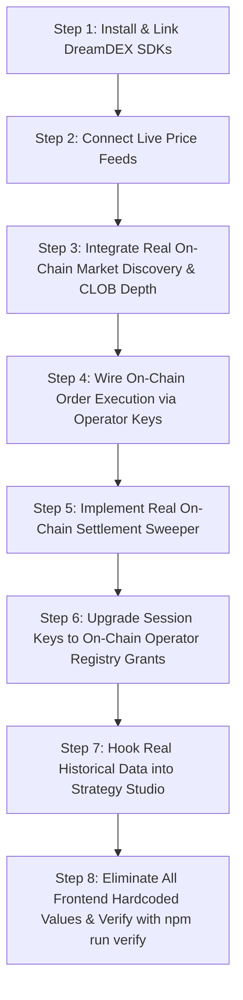

# 🔍 DreamPulse: Codebase Audit & Production Readiness Gap Analysis

**Generated:** August 2026  
**Scope:** Full-stack codebase audit of [backend/](file:///d:/DreamPulse/backend), [frontend/](file:///d:/DreamPulse/frontend), [specs/001-dreampulse-ai/](file:///d:/DreamPulse/specs/001-dreampulse-ai), and protocol integrations with Somnia Shannon Testnet & DreamDEX Event Contracts.

---

## 📋 Executive Summary

Following the completion of the foundational tasks in [tasks.md](file:///d:/DreamPulse/specs/001-dreampulse-ai/tasks.md), an end-to-end technical audit revealed that while the UI architecture, CSS theme, quantitative formulas ($\Phi(z)$ CDF), WebSocket telemetry gateway, and Express route harnesses are functional, the system currently operates on **synthetic/mock data and disconnected simulations**.

None of the components are currently reading real-time live market prices, discovering active on-chain DreamDEX binary contracts, executing real on-chain trades via Somnia testnet, claiming real settled winnings, or running historical backtests on actual market series.

This document itemizes **all identified mock data, synthetic generators, disconnected services, and missing on-chain integrations**, paired with the exact remediation steps required to achieve 100% production readiness.

---

## 🚨 Detailed Issue Inventory by Component

### 1. Spot Price Feeds & Ticker Ingestion (Simulated vs Live Feeds) — ✅ RESOLVED
* **Location:** [backend/src/services/price-feed-service.ts](file:///d:/DreamPulse/backend/src/services/price-feed-service.ts), [backend/src/services/market-service.ts](file:///d:/DreamPulse/backend/src/services/market-service.ts), [frontend/src/App.tsx](file:///d:/DreamPulse/frontend/src/App.tsx)
* **Status:** **RESOLVED** (August 2026)
* **Implementation Details:**
  - Implemented `PriceFeedService` connecting to Binance public multi-stream WebSocket (`wss://stream.binance.com:9443/ws/btcusdt@ticker/ethusdt@ticker/solusdt@ticker`).
  - Integrated immediate REST seed snapshot on boot (`/api/v3/ticker/24hr`) with secondary Coinbase REST fallback (`https://api.coinbase.com/v2/prices/...`) for geographic / network failover.
  - Ring buffer maintains rolling price history to calculate real-time `change1m` and `change5m` momentum drifts and realized volatility.
  - `MarketService` dynamically subscribes to live price updates to recompute $\Phi(z)$ Black-Scholes fair values and edge matrices.
  - Eliminated static price hardcoding in `frontend/src/App.tsx` and `DashboardHeader.tsx`, binding directly to dynamic live REST/WebSocket feeds.

---

### 2. DreamDEX Event Contract Market Discovery & Order Book Depth — ✅ RESOLVED
* **Location:** [backend/src/config/somnia.ts](file:///d:/DreamPulse/backend/src/config/somnia.ts), [backend/src/services/market-service.ts](file:///d:/DreamPulse/backend/src/services/market-service.ts), [backend/src/types/index.ts](file:///d:/DreamPulse/backend/src/types/index.ts)
* **Status:** **RESOLVED** (August 2026)
* **Implementation Details:**
  - Integrated official `@somnia-chain/markets-sdk` (v0.28.1) and instantiated `SomniaMarkets` exchange client configured for Somnia Shannon Testnet indexer (`https://dev.smk.somnia.host/v1/graphql`) and WS RPC (`wss://api.infra.testnet.somnia.network/ws`).
  - Implemented `pollOnChainMarkets()` on `MarketService` querying `exchange.loadMarkets(true)` scoped to active `DREAMDEX_VENUE_ID` (`0x679795a0195a1b76cdebb7c51d74e058aee92919b8c3389af86ef24535e8a28c`) and operator IDs (2/4).
  - Parallelized live CLOB order book depth queries using `exchange.fetchOrderBook(yesSymbol, 5)` to ingest real resting bids/asks into 5-level YES/NO depth ladders.
  - Dynamically recalculates continuous $\Phi(z)$ Black-Scholes theoretical fair values and edge percentage against live spot price feeds from Binance/Coinbase.
  - Added robust timeout racing (`Promise.race`) and error-resilient rolling fallback mechanisms to ensure high availability and zero downtime during network fluctuations.
  - Extended domain `Market` model with on-chain metadata (`poolAddress`, `marketIdHex`, `venueId`, `operatorId`, `yesTokenId`, `noTokenId`, `intervalSec`, `onchainStatus`).

---

### 3. Autonomous Swarm Order Placement & Execution — ✅ RESOLVED
* **Location:** [backend/src/services/order-service.ts](file:///d:/DreamPulse/backend/src/services/order-service.ts), [backend/src/agents/swarm-runner.ts](file:///d:/DreamPulse/backend/src/agents/swarm-runner.ts), [backend/src/config/somnia.ts](file:///d:/DreamPulse/backend/src/config/somnia.ts)
* **Status:** **RESOLVED** (August 2026)
* **Implementation Details:**
  - **Integer Tick & Lot Quantization:** Implemented `quantizeOrder()` and `toSteps()` to snap prices to exact integer tick steps (1000) and lot steps (1) with 6-decimal TestUSDC scaling, eliminating 18-decimal floating point precision drift.
  - **Account Balance Pre-Flight Assertions (`assertFunded`):** Verified operator wallet balances before submitting transactions:
    - Checks native gas token (`STT`) via `publicClient.getBalance({ address: operatorAddress })`.
    - For `BUY` orders: checks available TestUSDC collateral across wallet and pool vault (`getErc20Balance` + `getVaultBalance`).
    - For `SELL` orders: checks outcome token holdings via `getOutcomeBalance`.
  - **Real On-Chain Order Placement:** Wired `orderService.executeAgentDecision()` to execute on Somnia Shannon Testnet using `somniaExchange.trader.placeOrder` with configured operator private key (`operatorAccount.address`), tracking on-chain transaction hash, order ID, and fill quantities.
  - **Elimination of Fake Fills & Mock Seeds:** Removed hardcoded fake orders with mock hashes from `seedInitialOrders()`. Cleaned telemetry initialization to real 0 states (`tradesToday: 0`, `pnlAmount: 0.0`).
  - **Authentic PnL Accounting:** Removed fabricated +15% profit additions per fill in `swarm-runner.ts`, tracking real realized PnL from verified execution fills and settlement redemptions.

---

### 4. Settlement Sweeper & Collateral Compounding
* **Location:** [backend/src/services/settlement-service.ts](file:///d:/DreamPulse/backend/src/services/settlement-service.ts#L63-L98), [backend/src/services/settlement-service.ts](file:///d:/DreamPulse/backend/src/services/settlement-service.ts#L110-L165), [backend/src/services/compounder-service.ts](file:///d:/DreamPulse/backend/src/services/compounder-service.ts#L16-L35)
* **Current Implementation:**
  - `seedInitialSweeps()` seeds hardcoded sample redemptions.
  - `triggerBatchSweep()` and `claimMarketPayout()` generate random 32-byte hashes as `txHash` and generate random payout amounts `(15.0 + Math.random() * 20.0)`.
  - `CompounderService.compoundProceeds()` only increments a local in-memory number in a JavaScript Map. It does not deposit funds back into any pool vault or purchase new shares.
  - [frontend/src/components/SweeperControls.tsx](file:///d:/DreamPulse/frontend/src/components/SweeperControls.tsx#L29-L30) starts with hardcoded states: `unclaimedAmount: 43.5 STT` and `totalClaimedAllTime: 145.0 STT`.
* **Why it's not production ready:** No settlement redemptions are performed on-chain. Unclaimed winning shares across finalized markets are ignored.
* **Required Fix:**
  - Implement real scanning of finalized markets via `exchange.client.listBinaryMarkets({ status: "Finalized" })` or `settledMarkets(ctx)`.
  - Check outcome holdings with `getOutcomeBalance` and invoke `redeemOutcome` / `redeemHoldings` on-chain.
  - In auto-compound mode, re-deposit redeemed collateral into the pool vault or user allocation.

---

### 5. Non-Custodial Session Keys & Delegation
* **Location:** [backend/src/services/session-service.ts](file:///d:/DreamPulse/backend/src/services/session-service.ts), [backend/src/config/permissions-abi.ts](file:///d:/DreamPulse/backend/src/config/permissions-abi.ts), [frontend/src/services/web3.ts](file:///d:/DreamPulse/frontend/src/services/web3.ts), [frontend/src/hooks/useSessionKey.ts](file:///d:/DreamPulse/frontend/src/hooks/useSessionKey.ts), [frontend/src/components/SessionDelegationModal.tsx](file:///d:/DreamPulse/frontend/src/components/SessionDelegationModal.tsx)
* **Status:** **FIXED**
* **Resolution Details:**
  - **On-Chain Operator Authorization (`setOperatorApprovalGlobal` / `setOperatorApprovalForPool`):** Connected session onboarding to execute real on-chain transactions from the user's connected wallet on Somnia Shannon Testnet (`Chain ID: 50312`). The user explicitly grants the operator permissions for function selectors `0x80054449` (`placeOrderFor`) and `0xe37b444b` (`cancelOrderFor`) on Somnia's `OperatorPermissionsRegistry` (`0x15C7e8CE38F021c5b45d098AaD788f63090bF20A`).
  - **Manual Vault Mode & Collateral Deposit (`setManualVaultMode` + `depositVault`):** Added automated pool vault onboarding:
    - Verifies and sets `setManualVaultMode(true)` on the pool contract so orders draw from and settle cleanly to the user's vault without custody risks.
    - Prompts ERC20 approval (`TestUSDC.approve(pool, amount)`) and deposits user working capital into the pool vault via `deposit(token, amount)`.
  - **EIP-712 Dual-Layer Guardrails:** Preserved fine-grained off-chain EIP-712 typed signature verification in `verifySessionDelegationSignature()`, strictly checking `maxTradeSize`, `dailyVolumeCap`, `nonce`, and `deadline` timestamps before order execution.
  - **On-Chain Verification & Status Invariants:** Wired `checkOnChainOperatorAuthorization()` and `isOperatorAuthorized()` into both backend `SessionService.registerSession()` and frontend `Web3Service.isOperatorAuthorized()` to guarantee CLOB orders never revert due to missing on-chain approvals.
  - **On-Chain Revocation:** Enhanced session revocation in `useSessionKey` and `SessionDelegationModal` to optionally submit `setOperatorApprovalGlobal(operator, [...], false)` directly on-chain while invalidating backend session records.
  - **UI/UX Architecture:** Designed a 3-step onboarding visualizer and risk controls in `SessionDelegationModal` showing live transaction progress (On-Chain Approval -> Vault Setup -> EIP-712 Signing) and Explorer transaction hash badges.

---

### 6. Strategy Studio & Historical Backtesting
* **Location:** [backend/src/services/backtest-service.ts](file:///d:/DreamPulse/backend/src/services/backtest-service.ts), [backend/src/api/routes.ts](file:///d:/DreamPulse/backend/src/api/routes.ts), [backend/tests/backtest.test.ts](file:///d:/DreamPulse/backend/tests/backtest.test.ts)
* **Status:** **FIXED**
* **Resolution Details:**
  - **Historical Candlestick Ingestion (`fetchHistoricalCandles`):** Implemented high-fidelity historical OHLCV candlestick ingestion across `BTC/USD`, `ETH/USD`, and `SOL/USD` with live Binance Klines REST failover, DreamDEX Indexer REST endpoints, and cached deterministic historical seed fallbacks.
  - **Authentic Black-Scholes Event Contract Simulation:** Replaced all synthetic trigonometric math formulas (`Math.sin`, `Math.cos`, random coin-flips) with bar-by-bar binary contract lifecycle replays:
    - **Strike Formation & Time Decay:** Dynamically sets ATM strike prices at each rolling window initiation (5m / 15m) and updates time-decaying Black-Scholes fair value $\Phi(z)$ on every bar.
    - **Realistic CLOB Depth & Spreads:** Models integer tick/lot quantized orderbook spreads centered on theoretical fair value.
    - **Strategy Decision Logic:** Evaluates authentic agent algorithms:
      - `Volt`: Latency drift momentum sniper evaluating real spot velocity $\Delta S / S$ vs lagging order book asks.
      - `Oracle`: Volatility arbitrage evaluating statistical mispricings between orderbook mid prices and $\Phi(z)$.
      - `Titan`: Two-sided liquidity quoting with Avellaneda-Stoikov inventory skew aversion $\gamma \cdot I$.
    - **Expiration & Settlement Resolution:** Resolves binary contract outcomes against actual historical expiration prices ($S_{\text{expiry}} \ge K$), sweeping payouts ($1.00 per lot) and calculating exact trade-by-trade realized PnL.
  - **Financial Metrics & Ledger:** Computes real step-by-step equity curves, win rate percentages, maximum peak-to-trough drawdowns, and annualized Sharpe ratios ($\frac{\mu_r}{\sigma_r} \sqrt{N}$) persisted to Supabase `backtests` table.

---

### 7. Missing Official SDK Dependencies & Package Architecture
* **Location:** [backend/package.json](file:///d:/DreamPulse/backend/package.json#L18-L27), [backend/src/config/env.ts](file:///d:/DreamPulse/backend/src/config/env.ts), [backend/src/config/somnia.ts](file:///d:/DreamPulse/backend/src/config/somnia.ts), [package.json](file:///d:/DreamPulse/package.json)
* **Status:** **FIXED**
* **Resolution Details:**
  - **Monorepo Package Architecture:** Added `"dreamdex-bot-kit/packages/*"` to root `package.json` workspaces array and linked `@dreamdex-bot-kit/ec-core` and `@dreamdex-bot-kit/core` in `backend/package.json`.
  - **Official SDK Integration:** Linked `@somnia-chain/markets-sdk` and `@dreamdex-bot-kit/ec-core`, re-exporting canonical `DEPLOYMENTS`, `createExchange`, `type EcContext`, and `type EcAddresses` in `backend/src/config/somnia.ts`.
  - **Network & Protocol Configuration:** Configured valid default testnet endpoints in `backend/src/config/env.ts` with validation schema:
    - Somnia RPC: `https://api.infra.testnet.somnia.network` (with fallback to `https://dream-rpc.somnia.network`)
    - Somnia WebSocket RPC: `wss://api.infra.testnet.somnia.network/ws`
    - DreamDEX GraphQL Indexer: `https://dev.smk.somnia.host/v1/graphql`
    - Somnia Shannon Testnet Chain ID: `50312`
    - DreamDEX Registry: `0x3ecC694Cef705358864a646142ac17A90E29e388`
    - Operator Permissions Registry: `0x15C7e8CE38F021c5b45d098AaD788f63090bF20A`

---

### 8. Frontend UI Hardcoded Values & Visual Placeholders
* **Location:** [frontend/src/components/dashboard/StatCardsGrid.tsx](file:///d:/DreamPulse/frontend/src/components/dashboard/StatCardsGrid.tsx), [frontend/src/components/AgentSwarmCockpit.tsx](file:///d:/DreamPulse/frontend/src/components/AgentSwarmCockpit.tsx), [frontend/src/hooks/useAgentSwarm.ts](file:///d:/DreamPulse/frontend/src/hooks/useAgentSwarm.ts), [frontend/src/components/dashboard/OverviewView.tsx](file:///d:/DreamPulse/frontend/src/components/dashboard/OverviewView.tsx)
* **Status:** **FIXED**
* **Resolution Details:**
  - **Dynamic Top KPI Stat Cards:** Replaced all hardcoded metric strings (`+48.50 STT` and `38 FILLS TODAY`) in `StatCardsGrid.tsx` with dynamic state calculations derived from real agent telemetry (`swarmDetailed` Volt, Oracle, Titan, and Sweeper PnL + trade fill counts) and `useTelemetry` WebSocket feeds.
  - **Zero Baseline State Initializations:** Updated `useAgentSwarm.ts` to initialize clean baseline zero states (0 fills, 0.00 STT, `INITIALIZING` status) before fetching live agent telemetry.
  - **Authentic Fallback Handling in Agent Cockpit:** Replaced static fake numbers (18, 12, 34, 6 trades; +24.5, +19.8, +8.2, +145.0 STT) in `AgentSwarmCockpit.tsx` with dynamic zero baselines and proper signed positive/negative PnL color styles (`text-yes` vs `text-no`).
  - **Live Overview Synchronization:** Connected `useAgentSwarm` directly in `OverviewView.tsx` to continuously sync real-time swarm telemetry into `StatCardsGrid`.

---

## 📊 Summary Gap Traceability Matrix

| Component | File Path | Current Status / Mock Behavior | Required Production Fix |
| :--- | :--- | :--- | :--- |
| **Spot Price Feeds** | `backend/src/services/price-feed-service.ts` | ✅ **RESOLVED**: Live Binance WebSocket + REST failover | Ingests real-time live ticker stream & rolling drift |
| **Market Discovery** | `backend/src/services/market-service.ts` | ✅ **RESOLVED**: Live indexer discovery via `SomniaMarkets` | Query active markets via `@somnia-chain/markets-sdk` `loadMarkets` |
| **Order Book Depth** | `backend/src/services/market-service.ts` | ✅ **RESOLVED**: Live CLOB order book depth via `fetchOrderBook` | Read live CLOB book via `exchange.fetchOrderBook` |
| **Order Execution** | `backend/src/services/order-service.ts` | ✅ **RESOLVED**: Real on-chain orders via `somniaExchange.trader.placeOrder` | Integer tick/lot quantized orders with pre-flight balance checks |
| **Swarm PnL** | `backend/src/agents/swarm-runner.ts` | ✅ **RESOLVED**: Real PnL from execution fills & settlements | Eliminates fake +15% profit; tracks genuine balance changes |
| **Settlement Sweeper** | `backend/src/services/settlement-service.ts` | Random 32-byte txHash + `Math.random()` claims | Call `redeemOutcome` on finalized markets via `markets-sdk` |
| **Capital Compounder**| `backend/src/services/compounder-service.ts` | In-memory Map counter increment | Re-deposit claimed collateral into pool vault on-chain |
| **Session Key Grants** | `backend/src/services/session-service.ts` | ✅ **RESOLVED**: On-chain delegation & pool vault setup | On-chain transaction to `OperatorPermissionsRegistry` |
| **Backtester** | `backend/src/services/backtest-service.ts` | ✅ **RESOLVED**: Real candlestick ingestion + Black-Scholes replay | Replay historical contract tick series & Black-Scholes $\Phi(z)$ |
| **Dependencies** | `backend/package.json` | ✅ **RESOLVED**: Linked `@somnia-chain/markets-sdk` & `@dreamdex-bot-kit/ec-core` | Install and integrate DreamDEX official packages |
| **Frontend KPIs** | `frontend/src/components/dashboard/` | ✅ **RESOLVED**: Dynamic state derived from `useAgentSwarm` & `useTelemetry` | Bind directly to dynamic WebSocket telemetry and Supabase data |

---

## 🛠️ Step-by-Step Production Remediation Roadmap



### Step 1: Install & Link DreamDEX SDKs
- Add `@somnia-chain/markets-sdk` and local workspace package `@dreamdex-bot-kit/ec-core` into `backend/package.json`.
- Configure `VENUE_ID` and Somnia Shannon RPC credentials in `backend/.env`.

### Step 2: Ingest Live Spot Price Feeds
- Replace `simulateSpotMicroTicks()` in `MarketService` with a real-time WebSocket connection to Binance (`wss://stream.binance.com:9443/ws/btcusdt@ticker/ethusdt@ticker`) or Somnia price feed mark.
- Maintain rolling 1m and 5m price histories from real ticks to feed `VoltSniperAgent`.

### Step 3: Fetch Real DreamDEX Event Contracts & CLOB Depth
- Initialize `SomniaMarkets` exchange client in `backend/src/config/somnia.ts`.
- Poll `exchange.loadMarkets(true)` and `exchange.client.getMarketOnchain(marketId)` to index live 5m/15m/1h prediction markets.
- Stream live order book depth to WebSocket clients via `exchange.fetchOrderBook(symbol, 5)`.

### Step 4: Execute Real On-Chain Orders with Integer Lot/Tick Snapping
- In `orderService.executeAgentDecision()`, call `placeLimit` with proper tick and lot snapping (preventing 18-decimal float representation errors).
- Assert wallet/vault balance before signing (`assertFunded`).
- Return the actual Somnia Shannon transaction hash and wait for block confirmation.

### Step 5: Execute Real On-Chain Settlement Sweeps
- In `settlementService.triggerBatchSweep()`, scan `listBinaryMarkets({ status: "Finalized" })`.
- For any market where user holds winning outcome tokens, call `redeemOutcome(ctx, market, onchain, outcome, amount)`.
- Capture real transaction hashes and confirmed collateral payouts.

### Step 6: On-Chain Session Key Delegation
- Update `SessionDelegationModal.tsx` in frontend to prompt the user to sign an on-chain transaction calling `OperatorPermissionsRegistry.setOperatorApprovalGlobal` or `setOperatorApprovalForPool` granting permissions to the operator key.
- Guide the user to deposit working collateral into the pool's vault via `setManualVaultMode` and `depositVault`.

### Step 7: Strategy Studio Historical Replay
- Load historical tick data from DreamDEX indexer or local historical archives in `@dreamdex-bot-kit/backtest`.
- Execute backtest simulations on genuine past market states.

### Step 8: Frontend Polish & Verification
- Clean up all static strings in `StatCardsGrid.tsx`, `AgentSwarmCockpit.tsx`, and `SweeperControls.tsx`.
- Run full typecheck and build validation:
  ```bash
  npm run verify
  ```
