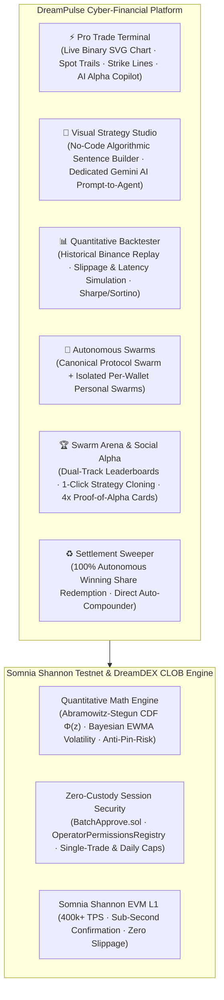
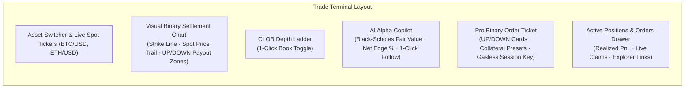
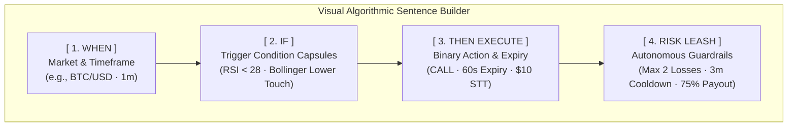
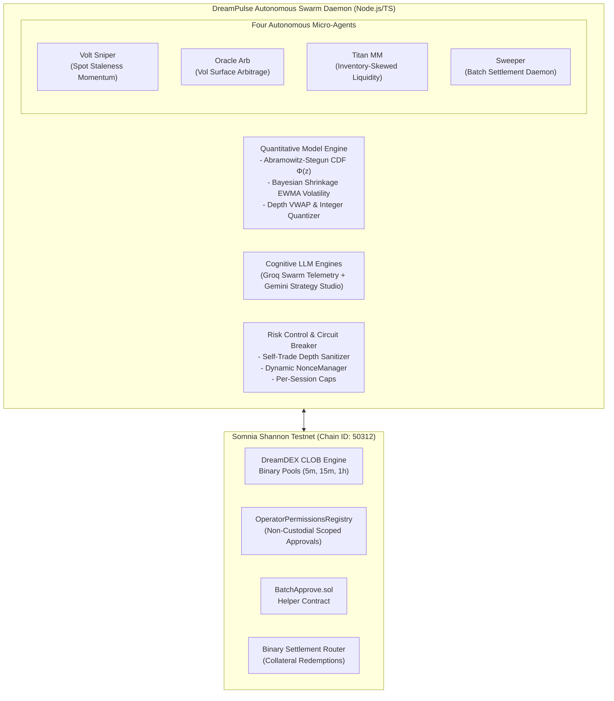
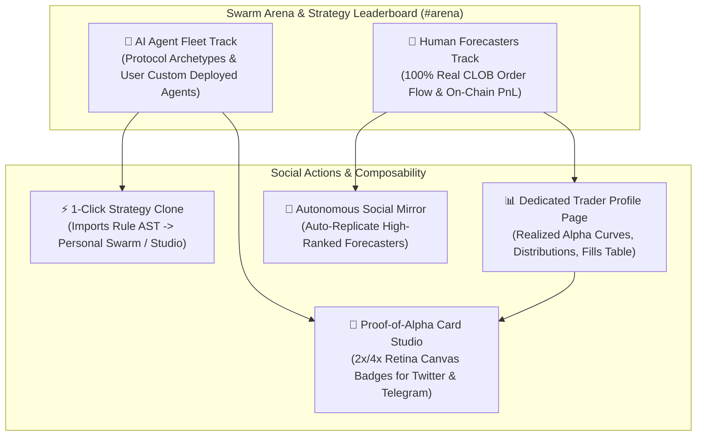
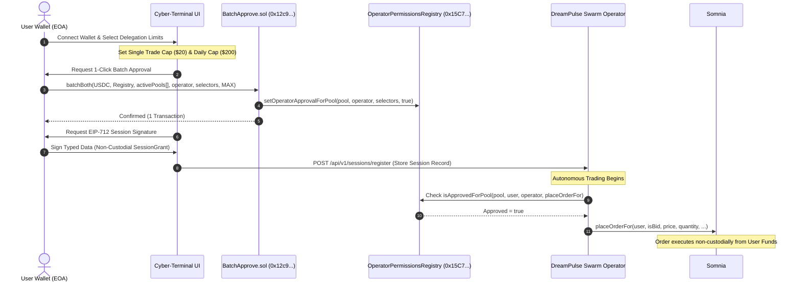
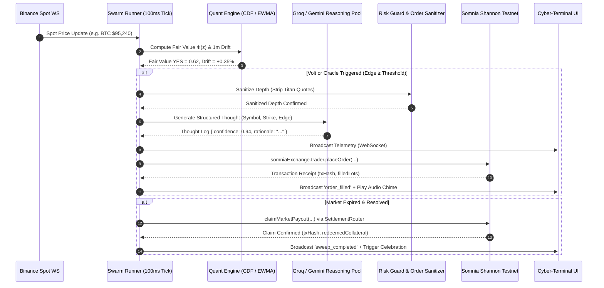

# DreamPulse AI

<p align="center">
  
</p>

<p align="center">
  <strong>The Next-Generation Cyber-Financial Trading Ecosystem on Somnia & DreamDEX Event Contracts.</strong>
  <br />
  <em>Unifying a Pro CLOB Trade Terminal with AI Alpha Copilot, a Visual No-Code Strategy Studio, Autonomous Multi-Agent Swarms, Quantitative Simulation, and Non-Custodial Session Delegation.</em>
</p>

<p align="center">
  <a href="https://shannon-explorer.somnia.network"></a>
  <a href="https://docs.dreamdex.io/developers/event-contracts"></a>
  <a href="https://github.com/zaikaman/DreamPulse/actions/workflows/ci.yml"></a>
  <a href="https://github.com/zaikaman/DreamPulse"></a>
  <a href="https://groq.com"></a>
</p>

---

## Somnia × DreamDEX Hackathon Quick Links

* **Live Demo Web App**: [https://dreampulse-ai.vercel.app/](https://dreampulse-ai.vercel.app/) *(or local `http://localhost:5174`)*
* **Somnia Shannon Testnet Chain ID**: `50312`
* **Custom `BatchApprove.sol` Deployment**: [`0x12c9c45fa740ce7469dacff368b08ca7edcaac26`](https://shannon-explorer.somnia.network/address/0x12c9c45fa740ce7469dacff368b08ca7edcaac26)
* **Somnia OperatorPermissionsRegistry**: [`0x15C7e8CE38F021c5b45d098AaD788f63090bF20A`](https://shannon-explorer.somnia.network/address/0x15C7e8CE38F021c5b45d098AaD788f63090bF20A)
* **SDK & Documentation Developer Feedback Report**: [Jump to Feedback Report](#developer-feedback-report-somnia--dreamdex-sdk)
* **2–3 Minute Judging Demo Script**: [Jump to Video Walkthrough](#23-minute-demo-video-walkthrough)
* **Automated Verification Suite**: `npm run verify` *(220/220 Unit & Integration Tests Passing, 100% Type Safety)*

---

## Table of Contents

1. [Executive Summary & Vision](#executive-summary--vision)
2. [The Core Problem & Market Opportunity](#the-core-problem--market-opportunity)
3. [The 6 Core Platform Pillars](#the-6-core-platform-pillars)
4. [Pro Trade Terminal with AI Alpha Copilot](#1-pro-trade-terminal-with-ai-alpha-copilot)
5. [Visual Strategy Studio (No-Code Agent Builder)](#2-visual-strategy-studio-no-code-agent-builder)
6. [Quantitative Backtester & Simulation Lab](#3-quantitative-backtester--simulation-lab)
7. [Autonomous Multi-Agent Swarms (Protocol & Personal)](#4-autonomous-multi-agent-swarms-protocol--personal)
8. [Autonomous Agent Personas (Volt, Oracle, Titan, Sweeper)](#autonomous-agent-personas)
9. [Swarm Arena, Strategy Leaderboards & Proof-of-Alpha](#5-swarm-arena-strategy-leaderboards--proof-of-alpha)
10. [Settlement Sweeper & Direct Compounder](#6-settlement-sweeper--direct-compounder)
11. [Mathematical & Quantitative Foundation](#mathematical--quantitative-foundation)
12. [Non-Custodial Session Delegation & BatchApprove.sol](#non-custodial-session-delegation--batchapprovesol)
13. [Institutional Design System & Minimalist UI](#institutional-design-system--minimalist-ui)
14. [Minimalist Onboarding & First-Run Activation Flow](#minimalist-onboarding--first-run-activation-flow)
15. [Smart Contracts & On-Chain Deployments](#smart-contracts--on-chain-deployments)
16. [Hackathon Judging Criteria Alignment](#hackathon-judging-criteria-alignment)
17. [Developer Feedback Report (Somnia & DreamDEX SDK)](#developer-feedback-report-somnia--dreamdex-sdk)
18. [System Architecture Diagrams](#system-architecture-diagrams)
19. [API & WebSocket Telemetry Protocol](#api--websocket-telemetry-protocol)
20. [Local Installation & Development Guide](#local-installation--development-guide)
21. [Verification & Test Suite (220/220 Passing)](#verification--test-suite-220220-passing)
22. [2–3 Minute Demo Video Walkthrough](#23-minute-demo-video-walkthrough)
23. [Future Roadmap Beyond Hackathon](#future-roadmap-beyond-hackathon)
24. [License & Acknowledgements](#license--acknowledgements)

---

## Executive Summary & Vision

**DreamPulse AI** is an institutional-grade, full-stack cyber-financial platform engineered specifically for **DreamDEX Event Contracts** on the **Somnia Shannon Testnet** (Chain ID `50312`).

Built to answer the Somnia × DreamDEX Hackathon challenge across **all tracks** — consumer-facing trading applications, AI trading agents, analytics tools, social prediction products, and settlement infrastructure — DreamPulse replaces fragmented bot scripts with an end-to-end decentralized exchange ecosystem:



Whether you are a **manual retail trader** seeking real-time Black-Scholes edge and sub-second gasless order execution, a **no-code creator** building and backtesting custom binary agents, a **passive liquidity provider** copytrading the canonical multi-agent swarm, or an **algorithmic quant** running isolated personal swarms, DreamPulse provides a seamless, unified gateway to prediction markets.

---

## The Core Problem & Market Opportunity

Decentralized Central Limit Order Book (CLOB) prediction markets are the fastest-growing primitive in Web3, yet venues like DreamDEX encounter five severe structural hurdles:

| Challenge | Impact on Event Contracts | DreamPulse AI Solution |
| :--- | :--- | :--- |
| **1. Cold-Start Liquidity** | Markets open with zero bids/asks or $>15\%$ spreads, alienating organic retail traders. | **Titan MM** seeds continuous two-sided liquidity within 2.5%–4.0% spreads scaled by real-time EWMA volatility. |
| **2. Quote Staleness & Latency** | Underlying spot prices (e.g. BTC, ETH) jump violently, but resting limit orders take seconds to adjust. | **Volt Sniper** monitors 100ms spot velocity against order book VWAP to eliminate stale mispricings. |
| **3. Vol Surface Mispricing** | Retail traders price binary contracts on raw sentiment rather than continuous Black-Scholes $\Phi(d_2)$. | **Oracle Arb** computes theoretical fair value and executes when post-spread edge exceeds $\ge 3.5\%$. |
| **4. Multi-Pool Approval UX Friction** | Rolling 5m/15m/1h prediction markets create dozens of independent pool addresses, each requiring manual wallet popups. | **`BatchApprove.sol`** custom smart contract enables 1-click batch delegation across all active and rolling event pools. |
| **5. Stranded Settlement Capital** | Traders must manually track contract expirations, wait for oracles, and claim payouts, stranding capital. | **Sweeper Daemon** autonomously batch-redeems winning shares across resolved pools and recycles collateral. |

---

## The 6 Core Platform Pillars

```
┌────────────────────────────────────────────────────────────────────────────────────────────────────────┐
│                                   DREAMPULSE AI UNIFIED ECOSYSTEM                                      │
├──────────────────────────┬──────────────────────────┬──────────────────────────────────────────────────┤
│ 1. PRO TRADE TERMINAL    │ 2. STRATEGY STUDIO       │ 3. QUANT BACKTESTER                              │
│ • Live SVG Settlement    │ • Visual Sentence Canvas │ • Binance 1m/5m/15m/1h Historical Candlesticks   │
│ • Strike Line & Zones    │ • Dedicated Gemini Copilot│ • Configurable Taker Slippage & Latency Delay    │
│ • AI Alpha Copilot       │ • Isolated tUSDC Allowance│ • Sharpe, Sortino, Profit Factor, Drawdown Curve │
│ • Gasless Session Ticket │ • JSON Rule AST Compiler │ • 1-Click Bridge to Personal/Global Swarm        │
├──────────────────────────┼──────────────────────────┼──────────────────────────────────────────────────┤
│ 4. AUTONOMOUS SWARMS     │ 5. SWARM ARENA & SOCIAL  │ 6. SETTLEMENT SWEEPER                            │
│ • 4 Autonomous Agents    │ • Dual-Track Leaderboard │ • Autonomous Resolution Scanning                 │
│ • Protocol vs Personal   │ • 1-Click Strategy Clone │ • Zero-Loss Multi-Pool Batch Claims              │
│ • COPY ↔ PERSONAL Modes  │ • Forecaster Mirroring   │ • 100% Direct Collateral Compounding             │
│ • Sub-100ms Evaluation   │ • 4x Retina Proof Cards  │ • Gas-Optimized Native STT Batching              │
└──────────────────────────┴──────────────────────────┴──────────────────────────────────────────────────┘
```

---

## 1. Pro Trade Terminal with AI Alpha Copilot

The **Trade Terminal** (`#trade` / `TradeTerminalView.tsx`) provides a professional, full-bleed execution environment for binary prediction contracts on Somnia DreamDEX:



### Key Terminal Features:
* **Visual Binary Settlement Chart (`EventContractChart.tsx`)**: Real-time SVG chart displaying a dashed strike settlement price line, glowing spot price trail, shaded **UP (Emerald)** and **DOWN (Rose)** payout zones, AI Forecast projection cone overlay, interactive crosshair tooltips, and floating time-to-settlement badges.
* **Dual-View Single-Click Book Toggle (`Show book / Hide book`)**: Effortlessly switch the main canvas between the visual settlement chart and the full CLOB Order Book Depth Ladder without losing order configuration state.
* **Recently Settled Rounds Carousel (`RecentlySettledRounds.tsx`)**: Horizontal scrolling strip tracking past 5m/15m/1h round resolutions with settlement prices, localized timestamps (24h format), and UP/DOWN resolution badges.
* **AI Alpha Copilot (`TraderCockpitTicket.tsx`)**:
  * Displays real-time analytical Black-Scholes fair value $\Phi(z)$ vs market odds.
  * Highlights calculated mathematical edge ($+12.7\%$) and real-time LLM rationale.
  * **`⚡ 1-Click Follow AI Trade`**: Automatically configures direction, lot size, and limit price to match the AI recommendation in a single click.
* **Pro Binary Order Ticket**:
  * High-conviction **▲ UP** and **▼ DOWN** selection cards with dynamic win multipliers and ROC return preview.
  * Collateral presets (`25%`, `50%`, `75%`, `100%`, `MAX`) and custom input with live balance verification.
  * **Gasless Session Key Execution**: Instant order submission via `placeOrderFor` on Somnia Shannon Testnet with direct MetaMask fallback.
* **Synchronized Local Time Engine (`useMarketCountdown.ts`)**: Derives the user's browser timezone (24h format) and synchronizes live countdown timers (`03:12`) in lockstep across header, chart, and order ticket.
* **Bottom Multi-Tab Drawer (`ActivePositionsDrawer.tsx`)**: Persistent bottom drawer displaying active positions, resting limit orders, and execution history with 1-click Shannon explorer links.

---

## 2. Visual Strategy Studio (No-Code Agent Builder)

The **Visual Strategy Studio** (`#studio` / `StrategyStudioView.tsx`) enables anyone to assemble, customize, and deploy automated trading agents with zero coding required:



### Core Studio Capabilities:
* **Interactive Sentence & Capsule Canvas**:
  * **Market & Timeframe**: Select asset (`BTC/USD`, `ETH/USD`) and candle resolution (`1m`, `5m`, `15m`, `1h`).
  * **Trigger Condition Capsules**: Add multi-indicator triggers (`RSI`, `BOLLINGER_LOWER`, `BOLLINGER_UPPER`, `EMA`, `SMA`, `PRICE_DRIFT`) with custom periods, comparison operators (`<`, `>`, `↑ Crosses Above`, `↓ Crosses Below`), and threshold values.
  * **Configurable Logic Gate**: Switch seamlessly between `ALL Must Agree (AND)` and `ANY May Trigger (OR)`.
  * **Binary Action Specification**: Direction (`CALL` / `PUT`), contract duration (`60s Turbo`, `5m`, `15m`, `1h`), and fixed lot sizing.
  * **Autonomous Risk Leash**: Max consecutive loss ceiling before auto-pause, loss cooldown duration, and minimum required pool payout percentage.
* **Dedicated Google Gemini Prompt-to-Strategy Co-Pilot**:
  * Plain English strategy description Omnibar (e.g. *"Aggressive BTC 60s Call sniper when RSI drops below 25 after a sharp dip"*).
  * **Exclusively Dedicated Gemini Engine**: Uses Google Gemini (`GEMINI_API_KEY`, `GEMINI_BASE_URL`, `GEMINI_MODEL`) strictly for user strategy synthesis, with zero background swarm consumption, reserving 100% of your Gemini quota for studio creation.
  * Instant pre-set suggestion chips for 1-click strategy generation.
* **Instant Ghost Radar**: Real-time heuristic performance HUD previewing estimated win rate, 24-hour trigger frequency, simulated net PnL, and profit factor.
* **Independent Agent Deployment & Isolated tUSDC Allowance**:
  * **Independent On-Chain Deployment**: Deploy each custom agent separately with dedicated execution authority, avoiding all-or-nothing swarm coupling.
  * **Granular tUSDC Bankroll Allowance**: Assign an individual maximum risk budget (e.g. `$25`, `$50`, `$100`, `$250`, `$500`, or custom tUSDC) to each agent, ensuring strict risk containment where no single strategy can drain your capital.
  * **Real-Time Allowance Depletion Meter**: Live visual progress tracking of allocated vs. spent tUSDC allowance, with remaining balance monitoring.
  * **1-Click Deploy / Pause Controls**: Toggle any agent between `DEPLOYED (Live Autotrading)` and `PAUSED (Dormant)` with single-click instant responsiveness.
  * **Inline Bankroll Modification**: Adjust an agent's tUSDC budget on the fly without needing to recreate or retune its underlying indicators.
* **Strategy Library & Starter Presets**:
  * Pre-loaded starter templates: *RSI Oversold Dip Sniper*, *Bollinger Band Exhaustion Fade*, and *Fast EMA Momentum Rider*.
  * Saved custom agents and deployed bankrolls persist to PostgreSQL via Supabase RLS with in-memory caching.

---

## 3. Quantitative Backtester & Simulation Lab

The **Quantitative Backtesting Lab** (`#backtest` / `StrategyStudio.tsx`) allows institutional-grade historical simulation of both canonical Protocol Swarm agents and user-created custom strategies:

* **Dual Simulation Architecture**:
  * **Protocol Swarm Agents**: Backtest canonical `Volt Sniper`, `Oracle Arb`, or `Titan MM` strategies under varying parameter sets.
  * **Custom User Agents**: Select any agent from your Strategy Studio library to replay its JSON rule AST bar-by-bar against real historical candlesticks.
* **Real Historical Market Data**:
  * Direct ingestion of 1m, 5m, 15m, and 1h Binance candlestick feeds across all supported trading pairs.
  * Forward-fill bar slicing prevents lookahead bias during indicator calculation (`RSI`, `EMA`, `Bollinger Bands`).
* **Realistic Execution Friction Modeling**:
  * Configurable taker slippage (in basis points, e.g. 4 bps).
  * Exchange maker/taker fee simulation (e.g. 2.5 bps).
  * Artificial network execution latency delay (e.g. 25ms–100ms).
* **Institutional Metrics Computed**:
  * **Sharpe & Sortino Ratios**: Downside risk-adjusted performance against volatility.
  * **Profit Factor & Trade Expectancy**: Total gross gains over gross losses and expected net return per fill.
  * **Win Rate & Payoff Ratio**: Win percentage and average win size over average loss size.
  * **Underwater Drawdown Curve**: Detailed visual timeline of peak-to-trough equity pullbacks.
* **Deployment Bridge**:
  * **Operators** → *Deploy to Global Swarm*: pushes verified parameters live to the canonical Protocol Swarm on Somnia Shannon.
  * **Traders** → *Deploy to My Personal Swarm*: automatically saves parameters to the user's isolated per-wallet swarm (`user_swarm_configs`), flipping the session to `PERSONAL` mode.

---

## 4. Autonomous Multi-Agent Swarms (Protocol & Personal)

DreamPulse coordinates an orchestrated **Multi-Agent Swarm** that operates on a high-frequency **100ms evaluation cadence**:



### Hybrid Personal Swarm: Copy-Trading vs Isolated Per-Wallet Swarms

**Traders own their strategy; custody never leaves their wallet.**

| Mode | Who trades? | How it works | On-chain invariant |
| :--- | :--- | :--- | :--- |
| **COPY (default)** | Protocol Swarm (Operator) + real-time copy-trade | New high-conviction signals on the canonical swarm are instantly replicated to every delegated wallet in `COPY` mode, under that wallet's own `maxTradeSize` / `dailyVolumeCap` guardrails. Zero custody moves — `transferFrom(user, operator)` only for the exact `price × quantity` collateral; operator pays STT gas. | Users in `COPY` never miss the swarm edge; they auto-benefit from Titan's liquidity and Volt/Oracle alphas. |
| **PERSONAL (isolated)** | Per-wallet ephemeral swarm | Once a trader customizes any Volt/Oracle/Titan slider in **My Personal Swarm** or clicks **Deploy to My Personal Swarm** from Strategy Studio, `user_swarm_configs.mode` flips to `PERSONAL`. The daemon spawns an independent evaluation loop per wallet — ephemeral `VoltSniperAgent` / `OracleArbAgent` / `TitanMMAgent` instances seeded with that wallet's parameters, with per-user rate limits (`60s` cooldown, `120s` opp dedup) and per-user inventory (`Titan` delta aggregated only from that wallet's unsettled fills). Copy-trading is **disabled** for this wallet while `PERSONAL`. | True strategy isolation: your drift thresholds (`0.05%–1.0%`), `minEdge` (`1%–12%`), `targetSpread` (`2%–8%`), `inventoryAversion` (`0.005–0.04`) and enabled flags execute independently of the Operator's policy. Revert to `COPY` with one click. |

---

## Autonomous Agent Personas

### 1. Volt (Spot Staleness Sniper)
* **Strategy**: Latency & Spot Velocity Momentum Taker.
* **Mechanism**: Ingests sub-second spot ticker price movements across underlying assets (BTC, ETH). When a rapid spot jump ($|\Delta_{\text{1m}}| \ge \text{adaptive drift threshold}$) occurs faster than market makers adjust their quotes on the DreamDEX CLOB, Volt executes an aggressive Immediate-Or-Cancel (`IOC`) taker order.
* **Risk Invariants**:
  * Expiry boundary guard: Holds execution in the final 15 seconds before expiration to prevent block-boundary mining reverts.
  * Macro trend confluence: Rejects trades if the 1-minute spike conflicts with the 5-minute macro directional trend ($\Delta_{\text{5m}}$).
  * Safe probability envelope: Limits taker buys strictly to the $[0.25, 0.68]$ range to maintain favorable risk-to-reward ratios.
  * Depth-aware VWAP execution: Calculates volume-weighted average price across multiple price levels to prevent self-slippage.

### 2. Oracle (Volatility Surface Arbitrageur)
* **Strategy**: Mathematical Implied vs. Realized Volatility Arbitrage.
* **Mechanism**: Continuously prices binary prediction event contracts using high-precision Black-Scholes standard normal cumulative distribution $\Phi(d_2)$. Compares theoretical fair value with the mid-market price on DreamDEX. When the net edge exceeds post-spread, post-fee thresholds ($\ge 3.5\%$), Oracle trades to exploit mispriced probability surface.
* **Risk Invariants**:
  * Real-time EWMA realized volatility: Ingests tick history variance with Bayesian prior shrinkage, resisting single-tick noise.
  * Time-decay theta scaling: Dynamically scales required margin of safety up to $+40\%$ in the final 5 minutes as gamma risk intensifies.
  * Gamma pin-risk lockout: Refuses execution when time remaining $< 45\text{s}$ or $> 7,200\text{s}$.
  * Minimum 8.0% Return-on-Capital hurdle ($E[\text{ROI}] \ge 8.0\%$).

### 3. Titan (Adaptive Two-Sided Market Maker)
* **Strategy**: Continuous Bid-Ask Liquidity Provision with Dynamic Inventory Skewing.
* **Mechanism**: Posts resting two-sided limit orders (`LIMIT`) symmetrically around theoretical fair value $\Phi(z)$ to capture the spread. To manage directional exposure, Titan dynamically skews reservation prices using super-linear gamma inventory aversion ($\gamma \cdot |\text{inv}|^{1.25}$) and order book depth imbalances.
* **Risk Invariants**:
  * Swarm-wide delta aggregation: Monitors open, unsettled fills across Volt, Oracle, and Titan to manage net portfolio inventory.
  * Tail spread expansion: Automatically widens spreads when event probabilities enter extreme wings ($<0.30$ or $>0.70$).
  * Self-trade protection: Active maker quotes are automatically registered in memory and subtracted from depth calculations, preventing Volt and Oracle from crossing Titan's own orders.

### 4. Sweeper (Autonomous Settlement & Direct Compounder)
* **Strategy**: Zero-Loss Capital Recycling & Batch Redemption.
* **Mechanism**: Monitors all prediction contracts transitioning from `Trading` $\rightarrow$ `Resolving` $\rightarrow$ `Finalized`. Identifies unclaimed winning outcome tokens (YES/NO) and invokes the DreamDEX settlement contracts to batch-claim payouts.
* **Risk Invariants**:
  * 100% automated compounding: Claimed `tUSDC` collateral is instantly recycled into the user's active trading allocation.
  * Gas-optimized batching: Aggregates multiple matured markets into single transaction calls to minimize native `STT` gas expenditure.

---

## 5. Swarm Arena, Strategy Leaderboards & Proof-of-Alpha

Fulfilling the hackathon's core vision for **Social Prediction Products**, **1-Click Strategy Cloning**, and **Viral Ecosystem Adoption**, DreamPulse introduces the **Swarm Arena** (`#arena`), **Dedicated Trader Profiles** (`#profile/:address`), and the **Proof-of-Alpha Card Studio**:



### 1. Dual-Track Arena & Quantitative Leaderboards
* **AI Agent Fleet Track**: Ranks autonomous algorithmic agents (such as *Volt Latency Sniper*, *Oracle Volatility Harvester*, *Titan MM*, and community-deployed custom agents) by real Net PnL, Win Rate %, Total Fills, Sharpe/Sortino Ratios, and Quantitative Rule Summaries.
* **Human Forecasters Track**: Aggregates 100% genuine manual and terminal order executions on Somnia DreamDEX CLOB event pools. Ranks forecasters with Copilot Synergy Scores, Win Streaks, Volume, and Tier Badges (`APEX`, `GRANDMASTER`, `MASTER`, `PRO`, `EMERGING`).
* **Multi-Timeframe Filtering**: Filter rankings across `24H` (active daily activity slice) and `7D` / `30D` / `ALL` (true inception performance metrics).

### 2. 1-Click Strategy Cloning & Social Mirroring
* **1-Click Strategy Cloning**: Clicking **Clone Strategy** on any agent copies its quantitative rule conditions, drift thresholds, and parameter AST directly into the user's Strategy Studio or Personal Swarm Cockpit.
* **Autonomous Social Mirror Trading**: Clicking **Mirror Forecaster** enables automated copy-trading for that trader's signals within the user's non-custodial session risk bounds (`maxTradeSize`, `dailyVolumeCap`).

### 3. Dedicated Full-Page Trader Profile (`#profile/:address`)
* **Interactive Cumulative Alpha Performance Curve**: Visualizes cumulative realized PnL trajectory across trading rounds with interactive date/delta inspection.
* **Recent On-Chain Executions Ledger**: Complete transaction history with market window badges, execution side (`BUY CALL` / `SELL NO`), stake amount, settled PnL, and direct Somnia Shannon Explorer verification links.
* **Asset Allocation & Horizon Breakdown**: Horizontal percentage allocation bars across asset pairs (`BTC/USD`, `ETH/USD`) and preferred binary expiry horizons (`1m`, `5m`, `15m`).
* **Deep-Linkable URL Architecture**: Supports canonical `#profile/0x...`, `#trader/0x...`, and `#arena` deep linking.

### 4. Proof-of-Alpha Card Studio (`ProofOfAlphaModal.tsx`)
A high-resolution graphics generator rendering 2x & 4x retina Canvas cards for social bragging on X (Twitter), Telegram, and Discord:
* **Curated Visual Themes**: *Cyber Emerald*, *Shannon Quantum*, *Apex Gold*, *Crimson Titan*, and *Dark Monochrome*.
* **Aspect Ratio & DPI Selection**: `16:9 Landscape` (Twitter cards) and `1:1 Square` (Discord/Telegram feeds) at `2x HD` or `4x Ultra-HD`.
* **Customizable Slogans & Taglines**: Live editable text input with 1-click preset badges.
* **High-Tech Cyber HUD Elements**: Toggleable isometric matrix grid, HUD corner brackets, glowing area sparkline with final apex node ring, and Somnia Shannon verification stamp.
* **1-Click Export**: Binary clipboard copy (`navigator.clipboard.write`), PNG download, and direct `Share on X` intent.

---

## 6. Settlement Sweeper & Direct Compounder

The **Settlement Sweeper** (`#settlement` / `SweeperControls.tsx`) provides zero-loss capital efficiency for prediction markets:

* **Real-Time Settlement Watcher**: Continuously monitors prediction contracts transitioning from `Trading` $\rightarrow$ `Resolving` $\rightarrow$ `Finalized`.
* **Zero-Loss Batch Redemption**: Queries claimable outcome token balances across all user and swarm positions, invoking the DreamDEX `BinarySettlement` router in single batch transactions.
* **100% Direct Collateral Compounding**: Immediately replenishes user session allowances and active trading bankrolls with redeemed `tUSDC` without requiring manual wallet claims or extra transaction fees.
* **Gas-Optimized STT Batching**: Bundles multiple market redemptions into one on-chain execution to minimize gas overhead on Somnia Shannon.

---

## Mathematical & Quantitative Foundation

DreamPulse adheres strictly to deterministic precision math and floating-point protection:

### 1. High-Precision Standard Normal CDF $\Phi(z)$
To guarantee sub-millisecond calculation speeds on standard Node.js/browser runtimes without external C++ bindings, DreamPulse implements the **Abramowitz & Stegun rational Chebyshev approximation** (Formula 7.1.26) for the Error Function $\text{erf}(x)$:

$$\text{erf}(x) \approx 1 - \left(a_1 t + a_2 t^2 + a_3 t^3 + a_4 t^4 + a_5 t^5\right) e^{-x^2}, \quad t = \frac{1}{1 + p x}$$

$$\Phi(z) = \frac{1}{2} \left[ 1 + \text{erf}\left(\frac{z}{\sqrt{2}}\right) \right]$$

* Maximum absolute error: $|\epsilon| < 1.5 \times 10^{-7}$.
* Guaranteed monotonic bounds: clamped between $[0.001, 0.999]$ to reflect DreamDEX CLOB probability rules.

### 2. Standardized $z$-Score ($d_2$) Formulation
For a binary prediction contract settling on whether underlying spot $S$ reaches strike price $K$ at expiry $T$:

$$z = \frac{\ln(S / K) + \left(r - \frac{1}{2}\sigma^2\right) T}{\sigma \sqrt{T}}$$

Where:
* $S$: Current spot price from live WebSocket feed.
* $K$: Market strike settlement price.
* $\sigma$: Real-time EWMA realized annualized volatility.
* $T$: Time remaining until resolution in fractional years ($T = \frac{\text{seconds}}{31{,}557{,}600}$).
* $r$: Risk-free interest rate ($r = 0.0$).

### 3. Bayesian Shrinkage EWMA Realized Volatility
Rather than relying on static volatility assumptions, DreamPulse computes sample variance of log returns over a rolling window and blends it with an asset-specific baseline prior:

$$\sigma_{\text{blended}} = w \cdot \sigma_{\text{realized}} + (1 - w) \cdot \sigma_{\text{baseline}}, \quad w = \min\left(1.0, \frac{N_{\text{ticks}}}{30}\right)$$

### 4. Reservation Price & Super-Linear Inventory Skew
Titan MM computes bid/ask quotes around fair value $\Phi(z)$ adjusted for inventory risk:

$$P_{\text{bid}} = \Phi(z) - \frac{\text{spread}}{2} - \text{sign}(\Delta) \cdot \gamma \cdot |\Delta|^{1.25}$$

$$P_{\text{ask}} = \Phi(z) + \frac{\text{spread}}{2} - \text{sign}(\Delta) \cdot \gamma \cdot |\Delta|^{1.25}$$

Where $\Delta = \text{Inventory}_{\text{YES}} - \text{Inventory}_{\text{NO}}$ and $\gamma$ is the inventory aversion parameter.

### 5. Depth-Weighted VWAP Calculation
When evaluating order book liquidity, taker agents simulate fills against the cumulative depth ladder:

$$P_{\text{VWAP}} = \frac{\sum_{i=1}^k P_i \cdot Q_i}{\sum_{i=1}^k Q_i}$$

If slippage $P_{\text{VWAP}} - P_{\text{top}} > \text{maxSlippage}$, execution is automatically aborted.

### 6. Quantitative Probability Stabilization Engine (Anti-Pin-Risk)
In ultra-short prediction contracts (5m, 15m), raw un-smoothed Black-Scholes probabilities suffer from **"Pin-Risk Cliff Degeneration"** as $T \to 0$ (the $\sigma \sqrt{T}$ denominator collapsing, turning micro-fluctuations into violent $10\% \leftrightarrow 90\%$ step-function flips). DreamPulse introduces a 4-tier quantitative stabilization engine:

1. **Short-Horizon Diffusion Regularization**: Enforces a non-zero diffusion buffer ($T_{\text{floor}} = 45\text{s}$) in $z$-score computation to prevent division by near-zero and preserve continuous, smooth probability density around the strike price.
2. **Multi-Factor Confluence Scoring**: Blends Black-Scholes theoretical probability $\Phi(z)$ ($60\%$) with a non-linear spot momentum drift sigmoid ($28\%$) and order book depth imbalance skew ($12\%$):
   $$P_{\text{confluence}} = 0.60 \cdot \Phi(z) + 0.28 \cdot \text{Sigmoid}\left(250 \cdot \Delta_{\text{1m}} + 150 \cdot \Delta_{\text{5m}}\right) + 0.12 \cdot \left(0.5 + 0.15 \cdot \text{DepthSkew}\right)$$
3. **Temporal EMA Probability Smoothing**: Filters out single-tick microstructure bid-ask bounce:
   $$P_{\text{smooth}}(t) = 0.25 \cdot P_{\text{confluence}}(t) + 0.75 \cdot P_{\text{smooth}}(t-1)$$
4. **Directional Conviction Hysteresis**: Employs an ATM deadband requiring sustained directional momentum to change AI bias, ensuring rock-solid, reliable trading recommendations.

---

## Non-Custodial Session Delegation & BatchApprove.sol

One of the largest UX hurdles in Web3 prediction markets is that **every newly deployed binary pool contract requires separate ERC-20 token approval and operator authorization**. 

DreamPulse solves this with a **two-tier non-custodial authorization architecture**:



### The Zero-Custody Invariant
Agents operate strictly via Somnia's `OperatorPermissionsRegistry` using scoped function selectors:
* `placeOrderFor` (`0x80054449` / `0x7f4806a6`)
* `cancelOrderFor` (`0xe37b444b` / `0x272714c6`)
* `reduceOrderFor` (`0x364c2587`)

> [!IMPORTANT]
> **Zero Withdrawal Privileges**: Withdrawal functions (`withdraw`, `transfer`, `drain`) are **cryptographically impossible** under this delegation model. Agents possess zero custody and cannot move funds outside of the DreamDEX binary pool ecosystem.

---

## Institutional Design System & Minimalist UI

The DreamPulse frontend is crafted with an ultra-refined, minimalist institutional quant design system built with React 18, TypeScript, Tailwind CSS, and custom GPU shaders:

* **Minimalist Obsidian & Slate Design System**: Calm dark aesthetic with frosted translucent panels (`.glass-card`, `.glass-panel`), bespoke HSL tokens, and Radix UI primitives.
* **Procedural Silk WebGL Shader Background**: Real-time Three.js GPU-accelerated fluid cloth simulation (`Silk.tsx`) creating smooth atmospheric depth behind the terminal.
* **Cinematic Landing Showcase**: Immersive entry portal featuring interactive live swarm telemetry, protocol architecture breakdown, and seamless Web3 wallet authentication.
* **Revamped Pro Event Contracts Trade Terminal With AI Alpha Copilot**: Full-bleed trading layout, visual binary settlement chart with strike lines and payout zones, single-click book toggle, localized 24h market countdowns, and instant session-key order execution.
* **Institutional 3-Category Sidebar**:
  * **Trading & Markets**: *Overview*, *Edge Radar (Black-Scholes mispricing)*, *Markets & Depth*, and *Trade Terminal (Pro Execution)*.
  * **Autonomous Agents & AI**: *Fleet Cockpit (Protocol & Personal Swarms)*, *Strategy Studio (Visual No-Code Builder)*, *Backtester (Simulation Lab)*, *Swarm Arena (Leaderboards & Social)*, and *AI Swarm Feed (Real-time Thought Stream)*.
  * **Portfolio & Settlement**: *Analytics (Sharpe/Sortino)* and *Settlement Sweeper (Batch Claim & Compound)*.
* **Global Command Palette (`⌘K / Ctrl+K`)**: Lightning-fast fuzzy search modal to jump between prediction markets, navigate views, and execute platform actions.
* **Procedural Web Audio Feedback**: Zero-asset synthesizer utilizing the Web Audio API to deliver millisecond-accurate acoustic feedback for order fills, opportunity alerts, and settlement sweeps.

---

## Minimalist Onboarding & First-Run Activation Flow

To ensure new users are never overwhelmed by the depth of trading modules, DreamPulse features a multi-tiered onboarding architecture designed to get traders from wallet connection to first value in under 60 seconds:

```
┌─────────────────────────────────────────────────────────────────────────────┐
│  LAYER 1: The First-Connect Glassmorphic Wizard (Modal Triggered on 1st Connect) │
│  "3 Steps to First Value in < 60 seconds"                                    │
└─────────────────────────────────────────────────────────────────────────────┘
                                      │
                                      ▼
┌─────────────────────────────────────────────────────────────────────────────┐
│  LAYER 2: Interactive Path Selector ("Choose Your Journey")                  │
│  [ Passive Swarm Copytrade ]   [ Pro Terminal & Copilot ]   [ Quant Studio ] │
└─────────────────────────────────────────────────────────────────────────────┘
                                      │
                                      ▼
┌─────────────────────────────────────────────────────────────────────────────┐
│  LAYER 3: Persistent Quick-Start Quest Bar (Top of Overview & Sidebar)      │
│  Progress: [████████░░░░] 2/4 Steps Completed (Claim Faucet -> Session -> 1st Trade)│
└─────────────────────────────────────────────────────────────────────────────┘
```

### 1. Interactive 4-Step First-Run Wizard (`OnboardingWizardModal.tsx`)
Auto-triggers on the very first wallet connection per address/device (persisted in `localStorage`):
1. **Network Verification**: Automatically verifies the connection to **Somnia Shannon Testnet** (Chain ID `50312`) and provides a 1-click network switch action.
2. **1-Click Testnet Collateral & Gas Faucet**: Immediately claims 1,000 tUSDC test collateral and verifies STT gas balance with instant acoustic chime feedback.
3. **Session Key Demystification & Delegation**: Explains non-custodial session keys (enabling sub-100ms algorithmic execution without signing MetaMask popups on every 30s contract) with 1-click authorization and customizable risk caps.
4. **Choose Your Trading Journey**: Presents 3 role-based pathways routing directly to your preferred workflow:
   * **Autonomous Swarm Copytrading (Recommended)**: Routes directly to `Fleet Cockpit` for 1-click zero-deposit copytrading.
   * **AI Alpha Copilot & Trade Terminal**: Routes directly to `Trade Terminal` for manual order execution with AI guidance.
   * **Edge Radar & Quant Studio**: Routes directly to `Edge Radar` for mathematical mispricing arbitrage and formula backtesting.

### 2. Getting Started Quests Bar (`OnboardingQuestBar.tsx`)
A sleek banner embedded at the top of the **Overview**:
* Real-time progress tracker (`2 / 4 Completed • 50%`).
* Interactive milestone pills: `Connect Wallet`, `Claim 1,000 tUSDC Faucet`, `Authorize Session Key`, and `Copytrade or Place Trade`.
* Dismissable with state persistence or expandable anytime via the **Guided Tour** trigger.

---

## Smart Contracts & On-Chain Deployments

All DreamPulse interactions execute on the **Somnia Shannon Testnet**:

| Contract / Entity | Address | Description | Explorer Link |
| :--- | :--- | :--- | :--- |
| **Somnia Shannon Chain ID** | `50312` | High-Performance EVM Layer 1 (400k+ TPS) | [Somnia Explorer](https://shannon-explorer.somnia.network) |
| **RPC Endpoint** | `https://dream-rpc.somnia.network` | Primary JSON-RPC Provider | — |
| **`BatchApprove.sol`** | `0x12c9c45fa740ce7469dacff368b08ca7edcaac26` | 1-Click Multi-Pool Approval & Delegation Helper | [View on Explorer](https://shannon-explorer.somnia.network/address/0x12c9c45fa740ce7469dacff368b08ca7edcaac26) |
| **`OperatorPermissionsRegistry`** | `0x15C7e8CE38F021c5b45d098AaD788f63090bF20A` | Somnia Native Session Delegation Registry | [View on Explorer](https://shannon-explorer.somnia.network/address/0x15C7e8CE38F021c5b45d098AaD788f63090bF20A) |
| **`BinaryModule`** | `0x3ecC694Cef705358864a646142ac17A90E29e388` | DreamDEX Core Binary Market Logic | [View on Explorer](https://shannon-explorer.somnia.network/address/0x3ecC694Cef705358864a646142ac17A90E29e388) |
| **`MarketsCore`** | `0x2802504314685D89bF6C992CA5a8e7cC78bc0294` | DreamDEX Market Management Contract | [View on Explorer](https://shannon-explorer.somnia.network/address/0x2802504314685D89bF6C992CA5a8e7cC78bc0294) |
| **`CLOBFactory`** | `0xb2BE8EE02F96379DB75f01802384593EBa9bfF04` | Central Limit Order Book Factory | [View on Explorer](https://shannon-explorer.somnia.network/address/0xb2BE8EE02F96379DB75f01802384593EBa9bfF04) |
| **`BinarySettlement`** | `0xbF4a49e0Dfd092e5FBE8E5761064C49533e6Ed23` | Settlement & Direct Collateral Redemption | [View on Explorer](https://shannon-explorer.somnia.network/address/0xbF4a49e0Dfd092e5FBE8E5761064C49533e6Ed23) |
| **`CollateralRouter`** | `0xbC0C9834B15ACE38bB50dDaa7d7f7C7CC4DC183C` | Collateral Vault Routing | [View on Explorer](https://shannon-explorer.somnia.network/address/0xbC0C9834B15ACE38bB50dDaa7d7f7C7CC4DC183C) |
| **`OracleHub`** | `0xe40db387cC98601Dd11bd634fF2f3AD5686dE32b` | Prophecy Oracle Settlement Engine | [View on Explorer](https://shannon-explorer.somnia.network/address/0xe40db387cC98601Dd11bd634fF2f3AD5686dE32b) |
| **`TestUSDC` (Collateral)** | `0x70a86D8842FB63C4Ad2b7cdddF530eBf1BB25d8E` | Protocol Trading Currency (6 decimals) | [View on Explorer](https://shannon-explorer.somnia.network/address/0x70a86D8842FB63C4Ad2b7cdddF530eBf1BB25d8E) |
| **Canonical Swarm Operator** | `0x93e300607c363E7D7a47e50f5c9fDf1723e859Cf` | Swarm Executor Wallet | [View on Explorer](https://shannon-explorer.somnia.network/address/0x93e300607c363E7D7a47e50f5c9fDf1723e859Cf) |

---

## Hackathon Judging Criteria Alignment

| Criteria & Weight | How DreamPulse AI Exceeds Expectations |
| :--- | :--- |
| **Innovation & Originality (20%)** | • Unifies consumer-facing trading, no-code agent creation, multi-agent swarms, quantitative simulation, and social prediction in a single cohesive platform.<br />• First implementation combining dual-engine LLM reasoning (Groq Qwen 2.5 + dedicated Google Gemini) with analytical Black-Scholes binary option mathematics.<br />• Solves the prediction market cold-start problem through automated, inventory-skewed market making. |
| **Technical Implementation (25%)** | • Deep integration with `@somnia-chain/markets-sdk` across orders, depth ladders, cancellations, and settlement redemptions.<br />• 220/220 unit and integration tests passing with 100% type safety and zero `any` types across 22 test suites.<br />• Built custom `BatchApprove.sol` smart contract deployed on Shannon Testnet to overcome protocol-level multi-pool approval barriers.<br />• Dynamic `NonceManager` handling sub-second on-chain concurrency and automated revert circuit breakers. |
| **User Experience & Design (20%)** | • High-aesthetic, minimalist institutional quant terminal inspired by modern hedge fund platforms (obsidian glassmorphism, GPU-accelerated Three.js Silk shader, and Radix UI primitives).<br />• **Interactive CLOB Trade Terminal**: 1-click depth ladder auto-fill, Limit & Market (IOC) order placement, collateral presets, live win payout calculations, and inline AI Alpha Copilot.<br />• Global Command Palette (`⌘K / Ctrl+K`) for sub-second keyboard-driven market navigation and execution.<br />• Zero-friction onboarding via 1-click non-custodial session delegation with strict single-trade caps and daily volume guardrails.<br />• Real-time WebSocket telemetry ($<50\text{ms}$ updates), live Black-Scholes Edge Radar, and procedural Web Audio acoustic feedback. |
| **Business & Ecosystem Impact (20%)** | • Directly solves the primary existential crisis of Event Contracts: stale quotes, wide spreads, and idle capital.<br />• Generates continuous, organic trading volume and liquidity on Somnia, showcasing its 400k+ TPS capacity.<br />• The `Sweeper` daemon guarantees that winning collateral is perpetually recycled back into active trading rather than remaining stranded.<br />• Democratizes strategy creation with no-code agent building, social leaderboards, and 1-click strategy cloning. |
| **Presentation & Demo (15%)** | • Complete technical documentation, interactive architecture flowcharts, mathematical explanations, and full API references.<br />• Clear 2–3 minute video presentation script demonstrating end-to-end user onboarding, trade terminal, strategy studio, swarm execution, live thoughts, and on-chain settlements. |

---

## Developer Feedback Report (Somnia & DreamDEX SDK)

*As requested in the official Hackathon Guidelines, the DreamPulse engineering team compiled this comprehensive developer feedback report based on building against `@somnia-chain/markets-sdk` (v0.28.1) and DreamDEX documentation on Somnia Shannon Testnet.*

### What Works Exceptionally Well
1. **High-Performance RPC & Finality**: Somnia's block times and sub-second confirmation enable real high-frequency on-chain trading loops that are impossible on standard Ethereum Layer 2s.
2. **Deterministic CLOB Matching Engine**: Order execution against resting limit orders is deterministic, fast, and gas-efficient.
3. **Clean viem/ethers Interoperability**: The `@somnia-chain/markets-sdk` integrates cleanly with standard `viem` `PublicClient` and `WalletClient` primitives.

### Critical Friction Points & Edge Cases Encountered
1. **Multi-Pool Approval Scalability**:
   * *Problem*: DreamDEX creates unique pool contract addresses for every rolling prediction window (e.g. BTC-5m, ETH-15m). Users had to approve every individual pool contract for both `TestUSDC` spending and `OperatorPermissionsRegistry` delegation.
   * *How DreamPulse Solved It*: We wrote and deployed `BatchApprove.sol` to allow 1-click batch approvals and operator delegation across dozens of active and future pool addresses in a single transaction.
   * *Recommendation for DreamDEX*: Implement a protocol-level Global Collateral Router allowance so users approve once globally for all binary pools created by `MarketCreatorFactory`.

2. **Silent Rejections on Non-Matching IOC Orders**:
   * *Problem*: When an `IOC` taker order was submitted at a price where book depth was insufficient, some calls returned `success: false` or reverted with `ImmediateOrCancelNoFill` without emitting an indexed log event, making error categorization non-trivial.
   * *How DreamPulse Solved It*: Added pre-flight order book depth checking (`assertFunded` & `sanitizeDepthForSelfTrade`) and submitted taker orders with `ORDER_TYPE.LIMIT` at quantized crossing ticks to guarantee match-or-rest behavior without reverts.

3. **Nonce Desynchronization in Concurrent Swarm Execution**:
   * *Problem*: Under high-frequency evaluations across multiple parallel agents, rapid-fire transactions triggered `nonce too low` or `replacement transaction underpriced` errors from the RPC node.
   * *How DreamPulse Solved It*: Implemented a serialized transaction queue (`executeOperatorTx`) wrapped with Viem's `nonceManager` with automated nonce resets and exponential backoff.

4. **Indexer Sync Latency on Newly Deployed Rolling Markets**:
   * *Problem*: When a new 5-minute market is listed on-chain, the GraphQL indexer sometimes experienced a 5–15 second lag before reflecting `MarketStatus.Trading`, causing premature reverts if orders were submitted immediately.
   * *How DreamPulse Solved It*: Built a dual-fallback polling service (`marketService.pollOnChainMarkets`) that cross-validates indexer responses directly against on-chain contract state via `publicClient.readContract`.

---

## System Architecture Diagrams

### Real-Time Swarm Execution Cycle



---

## API & WebSocket Telemetry Protocol

The DreamPulse backend daemon exposes a comprehensive REST and WebSocket gateway:

### REST API Endpoints

| Method | Endpoint | Description |
| :--- | :--- | :--- |
| `GET` | `/api/v1/markets` | Returns all active prediction contracts with strike, window, status, and implied odds. |
| `GET` | `/api/v1/markets/:id/depth` | Returns live sanitized CLOB bid/ask ladders with lot sizes and price ticks. |
| `GET` | `/api/v1/markets/spot` | Returns sub-second spot ticker prices, 1m/5m drifts, and EWMA realized volatility. |
| `GET` | `/api/v1/markets/anomalies` | Returns identified pricing anomalies where market price deviates from Black-Scholes $\Phi(z)$. |
| `POST` | `/api/v1/sessions/register` | Registers a non-custodial session delegation with EIP-712 signature and risk caps. |
| `GET` | `/api/v1/sessions/:userAddress` | Retrieves the active session, spent volume, and allowance readiness for a user. |
| `POST` | `/api/v1/sessions/:id/revoke` | Instantly revokes an active trading session. |
| `GET` | `/api/v1/agents/status` | Returns operational status, latencies, trade counts, and PnL across all 4 agents (Protocol Swarm). |
| `POST` | `/api/v1/agents/toggle` | Administrative endpoint (Operator only) to enable/disable specific agents on the Protocol Swarm. |
| `GET` | `/api/v1/swarm/my-config?userAddress=0x…` | Retrieves the caller's `PersonalSwarmConfig` (`mode COPY|PERSONAL`, per-agent toggles & params). |
| `PUT` | `/api/v1/swarm/my-config` | Upserts the caller's personal swarm config — saving any agent param auto-flips `mode` to `PERSONAL`. |
| `POST` | `/api/v1/swarm/mode` | Explicitly switches `{ userAddress, mode: COPY|PERSONAL }` (PERSONAL ⇒ isolated swarm, COPY ⇒ mirror). |
| `POST` | `/api/v1/swarm/toggle` | Toggles a single personal agent `{ userAddress, agentType, enabled }`. |
| `POST` | `/api/v1/swarm/config` | Updates a single personal agent's params `{ userAddress, agentType, config }` (validated ranges). |
| `GET` | `/api/v1/swarm/my-status?userAddress=0x…` | Returns per-wallet isolated PnL / fills / sweeper attribution + `isCopyMode` flag. |
| `POST` | `/api/v1/swarm/reset` | Resets the caller's swarm back to `COPY` (mirroring the Protocol Swarm, disables isolation). |
| `GET` | `/api/v1/orders` | Paginated query of order history with filtering by agent, outcome, status, and scope. |
| `GET` | `/api/v1/sweeper/summary` | Returns claimable unclaimed balances, all-time claimed amounts, and active settlements. |
| `POST` | `/api/v1/backtest/run` | Executes quantitative historical backtest with custom strategy and friction parameters. |
| `GET` | `/api/v1/agents/custom` | Retrieves custom user strategies and starter templates from PostgreSQL. |
| `POST` | `/api/v1/agents/custom` | Saves a new custom binary options agent with JSON rule AST conditions and risk leash. |
| `GET` | `/api/v1/agents/custom/:id` | Retrieves a specific custom agent definition. |
| `PUT` | `/api/v1/agents/custom/:id` | Updates parameters, rules, or state of a custom agent. |
| `DELETE` | `/api/v1/agents/custom/:id` | Deletes a custom agent from database and cache. |
| `POST` | `/api/v1/agents/generate` | Generates a structured strategy specification from natural language using dedicated Gemini API. |
| `POST` | `/api/v1/agents/custom/:id/deploy` | Deploys an individual custom agent for autonomous execution with dedicated tUSDC allowance. |
| `POST` | `/api/v1/agents/custom/:id/pause` | Pauses an active custom agent's autonomous trading loop. |
| `POST` | `/api/v1/agents/custom/:id/allowance` | Sets or updates the maximum allocated tUSDC bankroll allowance for an agent. |
| `GET` | `/api/v1/arena/leaderboard/agents` | Returns ranked AI agent fleet with PnL, Win Rate, Sharpe, and Rule AST summaries. |
| `GET` | `/api/v1/arena/leaderboard/traders` | Returns ranked Human Forecasters aggregating 100% genuine CLOB orders. |
| `GET` | `/api/v1/arena/trader/:address/profile` | Retrieves detailed forecaster profile with equity curve, asset allocation, and fill history. |
| `POST` | `/api/v1/arena/agent/:id/clone` | Clones an agent strategy directly into the user's custom strategy library. |
| `POST` | `/api/v1/arena/copytrade/toggle` | Toggles autonomous social mirror trading for a target forecaster. |
| `GET` | `/api/v1/arena/stats` | Global arena statistics including aggregate volume, community alpha, and active swarms. |
| `GET` | `/api/health` | Service health status, uptime, and database connectivity. |

### Real-Time WebSocket Telemetry (`/ws/telemetry`)

Clients connect via WebSocket to receive multiplexed streaming events:
* `markets` — Real-time spot price updates and contract window status transitions.
* `order_book` — Instantaneous CLOB depth ladder shifts on fill or cancel.
* `agent_thoughts` — Live structured thought feed from Groq and Gemini cognitive engines.
* `orders` & `order_filled` — Execution events with transaction hash, fill size, and realized PnL.
* `sweep_completed` — Payout redemption confirmations and recycled collateral events.

---

## Local Installation & Development Guide

### Prerequisites
* **Node.js**: `v20.0.0` or higher
* **npm**: `v10.0.0` or higher
* **Git**

### 1. Clone Repository & Install Dependencies
```bash
git clone https://github.com/zaikaman/DreamPulse.git
cd DreamPulse

# Install workspace root dependencies (both frontend and backend)
npm install
```

### 2. Configure Environment Variables

**Backend Configuration (`backend/.env`):**
```bash
cp backend/.env.example backend/.env
```
Edit `backend/.env` with your credentials:
```env
PORT=5000
NODE_ENV=development
OPERATOR_ADMIN_SECRET=your-secure-admin-secret

# Supabase (PostgreSQL & Realtime)
SUPABASE_URL=https://your-project.supabase.co
SUPABASE_SERVICE_ROLE_KEY=your-service-role-key
SUPABASE_ANON_KEY=your-anon-key

# LLM Cognitive Engines
# 1. Groq Multi-Key Pool (Exclusively for Real-Time Swarm Telemetry & Reasoning)
GROQ_BASE_URL=https://api.groq.com/openai/v1
GROQ_MODEL=qwen/qwen3.6-27b
GROQ_API_KEY=gsk_your_groq_key_1
GROQ_API_KEY_2=gsk_your_groq_key_2

# 2. Google Gemini (Exclusively for Strategy Studio Builder)
GEMINI_BASE_URL=https://generativelanguage.googleapis.com/v1beta/openai/
GEMINI_API_KEY=your_gemini_api_key
GEMINI_MODEL=gemini-2.5-flash

# Somnia Shannon Testnet
SOMNIA_RPC_URL=https://dream-rpc.somnia.network
SOMNIA_WS_URL=wss://api.infra.testnet.somnia.network/ws
INDEXER_URL=https://dev.smk.somnia.host/v1/graphql
OPERATOR_PRIVATE_KEY=0x...your_funded_shannon_testnet_private_key
```

**Frontend Configuration (`frontend/.env`):**
```bash
cp frontend/.env.example frontend/.env
```
```env
VITE_BACKEND_HTTP_URL=http://localhost:5000/api/v1
VITE_BACKEND_WS_URL=ws://localhost:5000/ws/telemetry
VITE_SUPABASE_URL=https://your-project.supabase.co
VITE_SUPABASE_ANON_KEY=your-anon-key
VITE_SOMNIA_CHAIN_ID=50312
VITE_SOMNIA_RPC_URL=https://dream-rpc.somnia.network
VITE_SOMNIA_EXPLORER_URL=https://shannon-explorer.somnia.network
```

### 3. Launch Local Development Environment
Run both backend daemon and frontend Vite server concurrently:
```bash
npm run dev
```
* **Frontend Web App**: `http://localhost:5174`
* **Backend REST Gateway**: `http://localhost:5000/api/v1`
* **WebSocket Stream**: `ws://localhost:5000/ws/telemetry`

### 4. Production Cloud Deployment (Vercel & Heroku)
For step-by-step instructions on deploying the **Frontend to Vercel** and the **Backend to Heroku**, refer to the dedicated [Production Deployment Guide](./DEPLOYMENT.md).

---

## Verification & Test Suite (220/220 Passing)

DreamPulse enforces strict production-grade quality invariants with an automated **Vitest** test suite covering quantitative mathematics, smart contract session boundaries, multi-agent evaluation logic, backtesting algorithms, social leaderboard calculations, WebSockets, and API endpoints.

```bash
# Run complete test suite across the workspace
npm test

# Run backend test suite with V8 coverage table
npm run test:coverage --workspace=dreampulse-backend

# Run full project verification (typecheck + tests + production build)
npm run verify
```

### Comprehensive Test Suite Breakdown

| Test File | Tests | Coverage & Verified Invariants |
| :--- | :---: | :--- |
| [`tests/quantitative.test.ts`](file:///d:/DreamPulse/backend/tests/quantitative.test.ts) | **20** | Abramowitz-Stegun normal CDF $\Phi(z)$, Standardized $z$-Score ($d_2$), Bayesian EWMA realized volatility, inventory-skewed reservation prices, depth VWAP, integer quantization arithmetic, and net EV edge filtering. |
| [`tests/api.test.ts`](file:///d:/DreamPulse/backend/tests/api.test.ts) | **25** | Express REST API health, market lists, order book depth ladders, anomaly feeds, telemetry stream endpoints, session management routes, order execution logs, copy-trade toggle, and sweeper trigger. |
| [`tests/auth-middleware.test.ts`](file:///d:/DreamPulse/backend/tests/auth-middleware.test.ts) | **21** | EIP-712 auth signatures, Supabase JWT minting, verification, tamper detection, cookie parsing, SIWE, and route guard middleware. |
| [`tests/agents.test.ts`](file:///d:/DreamPulse/backend/tests/agents.test.ts) | **19** | Volt spot staleness sniper momentum triggers, Oracle volatility surface arb logic, Titan two-sided market maker quotes, inventory aversion bounds, self-trade prevention depth filtering, and multi-agent swarm runner execution. |
| [`tests/session.test.ts`](file:///d:/DreamPulse/backend/tests/session.test.ts) | **15** | Non-custodial session registration, EIP-712 typed signature verification, single trade size caps ($20 limit), cumulative daily volume caps ($200 limit), session revocation, multi-wallet isolation, and copy-trade target filtering. |
| [`tests/config-bootstrap.test.ts`](file:///d:/DreamPulse/backend/tests/config-bootstrap.test.ts) | **13** | HttpOnly cookies, Somnia network client, Supabase credentials, and operator ABI selectors. |
| [`tests/settlement.test.ts`](file:///d:/DreamPulse/backend/tests/settlement.test.ts) | **11** | Matured market resolution detection, automated winning share redemptions via Sweeper daemon, 100% collateral compounding into active trading balances, and multi-market batch claim aggregation. |
| [`tests/price-feed-operator.test.ts`](file:///d:/DreamPulse/backend/tests/price-feed-operator.test.ts) | **11** | Real-time spot price feeds, realized volatility, staleness detection, personal swarm configurations, and on-chain operator permissions. |
| [`tests/user-swarm.test.ts`](file:///d:/DreamPulse/backend/tests/user-swarm.test.ts) | **10** | Personal swarm isolated parameters, mode switching (`COPY` vs `PERSONAL`), per-wallet ephemeral swarm spawning, independent inventory tracking, and rate limits. |
| [`tests/websocket.test.ts`](file:///d:/DreamPulse/backend/tests/websocket.test.ts) | **10** | Telemetry WebSocket gateway, batched ticks, depth ladders, agent thoughts, PnL updates, and high-frequency market emitter. |
| [`tests/leaderboard.test.ts`](file:///d:/DreamPulse/backend/tests/leaderboard.test.ts) | **9** | Dual-track Swarm Arena rankings, Sharpe/Sortino ratios, APEX tier badges, 100% real human forecaster order aggregation, Copilot synergy, detailed trader profile generation, 1-click strategy cloning, and global arena stats. |
| [`tests/analytics-anomaly.test.ts`](file:///d:/DreamPulse/backend/tests/analytics-anomaly.test.ts) | **9** | Black-Scholes edge anomaly detector, severity classifications, multi-range PnL analytics, Sharpe ratios, and equity curve generation. |
| [`tests/custom-evaluator-runner.test.ts`](file:///d:/DreamPulse/backend/tests/custom-evaluator-runner.test.ts) | **7** | Technical indicators (RSI, EMA, SMA, Bollinger Bands), custom rule evaluations, and multi-agent swarm runner loops. |
| [`tests/order-service.test.ts`](file:///d:/DreamPulse/backend/tests/order-service.test.ts) | **6** | User manual orders, autonomous agent executions, event-driven market settlements, pagination, and PnL reconciliation. |
| [`tests/compounder-custom-agent.test.ts`](file:///d:/DreamPulse/backend/tests/compounder-custom-agent.test.ts) | **6** | Automated 100% compounding protocol, session allowance replenishment, custom agent lifecycle (creation, deployment, pauses, settlements), and custom multi-agent swarms. |
| [`tests/backtest.test.ts`](file:///d:/DreamPulse/backend/tests/backtest.test.ts) | **6** | Historical backtesting engine against Binance tick data, Sortino ratio, Profit Factor, Max Drawdown underwater curve computations, fee and slippage simulations. |
| [`tests/market-service.test.ts`](file:///d:/DreamPulse/backend/tests/market-service.test.ts) | **5** | Somnia on-chain CLOB order book polling, GraphQL indexer query parsing, anomaly detection (spread/staleness/mispricing), Binance spot ticker ingestion, and fallback market generation. |
| [`tests/custom-agent.test.ts`](file:///d:/DreamPulse/backend/tests/custom-agent.test.ts) | **5** | Custom deployed agents evaluation engine, starter templates, trade fills, settlements, and dedicated tUSDC allowance depletion tracking. |
| [`tests/llm.test.ts`](file:///d:/DreamPulse/backend/tests/llm.test.ts) | **4** | Groq Qwen 2.5 multi-key round-robin rotation, persistent key index, structured reasoning thoughts, and exclusive Google Gemini Strategy Studio isolation. |
| [`tests/setup.test.ts`](file:///d:/DreamPulse/backend/tests/setup.test.ts) | **3** | Environment configuration sanity check, Somnia Shannon network (Chain ID `50312`), and contract constants validation. |
| [`tests/base-agent.test.ts`](file:///d:/DreamPulse/backend/tests/base-agent.test.ts) | **3** | `BaseAgent` abstract class lifecycle, risk validation limits (single trade cap, cumulative daily cap, expiration check), and thought log events. |
| [`tests/bootstrap-lifecycle.test.ts`](file:///d:/DreamPulse/backend/tests/bootstrap-lifecycle.test.ts) | **3** | Express server lifecycle, CORS origin filters, and root health check. |
| **Total** | **220** | **100% Passing across 22 test suites with zero failures and zero `any` types** |

### Test Suite Execution Output
```
 RUN  v3.2.7 D:/DreamPulse/backend

 ✓ tests/setup.test.ts (3 tests)
 ✓ tests/quantitative.test.ts (20 tests)
 ✓ tests/settlement.test.ts (11 tests)
 ✓ tests/llm.test.ts (4 tests)
 ✓ tests/backtest.test.ts (6 tests)
 ✓ tests/agents.test.ts (19 tests)
 ✓ tests/user-swarm.test.ts (10 tests)
 ✓ tests/leaderboard.test.ts (9 tests)
 ✓ tests/custom-agent.test.ts (5 tests)
 ✓ tests/api.test.ts (25 tests)
 ✓ tests/market-service.test.ts (5 tests)
 ✓ tests/session.test.ts (15 tests)
 ✓ tests/auth-middleware.test.ts (21 tests)
 ✓ tests/base-agent.test.ts (3 tests)
 ✓ tests/analytics-anomaly.test.ts (9 tests)
 ✓ tests/price-feed-operator.test.ts (11 tests)
 ✓ tests/order-service.test.ts (6 tests)
 ✓ tests/compounder-custom-agent.test.ts (6 tests)
 ✓ tests/custom-evaluator-runner.test.ts (7 tests)
 ✓ tests/websocket.test.ts (10 tests)
 ✓ tests/config-bootstrap.test.ts (13 tests)
 ✓ tests/bootstrap-lifecycle.test.ts (3 tests)

 Test Files  22 passed (22)
      Tests  220 passed (220)
   Duration  16.89s
```

---

## 2–3 Minute Demo Video Walkthrough

A structured script demonstrating all capabilities during the hackathon judging evaluation:

* **0:00 – 0:30 (The Problem & Full Platform Vision)**:
  * Open with DreamDEX Event Contracts challenge: order book liquidity cold-start, quote staleness, and fragmented UI.
  * Introduce **DreamPulse AI** as the comprehensive institutional prediction ecosystem: Pro Trade Terminal, No-Code Agent Studio, and Autonomous Swarms on Somnia.
* **0:30 – 1:00 (Non-Custodial Onboarding & BatchApprove)**:
  * Connect MetaMask on Somnia Shannon Testnet.
  * Open **Session Delegation Modal**: showcase 1-click batch delegation via `BatchApprove.sol` and EIP-712 signature.
  * Demonstrate strict risk parameters: single-trade cap ($20) and daily volume cap ($200) with zero withdrawal privileges.
* **1:00 – 1:40 (Pro Trade Terminal with AI Alpha Copilot)**:
  * Navigate to **Trade Terminal**: show real-time visual binary settlement chart with strike price line, live spot price trail, and UP/DOWN payout zones.
  * Toggle between visual settlement chart and CLOB Order Book Depth Ladder with 1-click book toggle.
  * Highlight **AI Alpha Copilot**: Black-Scholes fair value, mathematical edge (+12.7%), and 1-click follow trade execution.
* **1:40 – 2:10 (Visual Strategy Studio & Quant Backtesting)**:
  * Switch to **Strategy Studio**: build a custom binary agent using the Notion-style capsule builder (`WHEN -> IF -> THEN -> RISK LEASH`) and dedicated Gemini natural language prompt.
  * Set a granular tUSDC bankroll allowance ($50) and deploy the custom agent.
  * Jump to **Backtester**: run a historical simulation against Binance tick data with 4 bps slippage and 25ms execution latency, reviewing Sortino ratio and drawdown curves.
* **2:10 – 2:40 (Autonomous Swarm Execution & Live AI Thoughts)**:
  * Open **Fleet Cockpit** & **AI Swarm Feed**: show real-time cognitive reasoning stream from Volt, Oracle, and Titan with sub-second latencies and tx hashes on Somnia Explorer.
  * Showcase `COPY ↔ PERSONAL` mode toggle for isolated per-wallet swarm execution.
* **2:40 – 3:00 (Swarm Arena, Proof-of-Alpha & Autonomous Settlement)**:
  * Check **Swarm Arena**: show dual-track leaderboards, 1-click strategy cloning, and export a 4x Ultra-HD Proof-of-Alpha Card.
  * Matured market resolution: show **Sweeper** detecting finalized contract and auto-compounding winning collateral.
  * Highlight production readiness (220/220 tests, 0 `any` types) and Somnia ecosystem impact.

---

## Future Roadmap Beyond Hackathon

1. **Mainnet Somnia Deployment**: Transition all contracts from Shannon Testnet to Somnia Mainnet upon launch.
2. **Multi-Asset Volatility Surfaces**: Expand beyond BTC/USD and ETH/USD to SOL, SOMNIA, and commodity event contracts.
3. **Cross-Chain Collateral Bridging**: Seamless 1-click deposits from Arbitrum, Base, and Ethereum into Somnia Shannon tUSDC.
4. **Decentralized Strategy Marketplace**: Allow strategy creators to tokenize and monetize their custom agents with performance fee revenue splits.
5. **Mobile Progressive Web App (PWA)**: Full tactile mobile trade terminal with biometric session signatures and push notification alerts.

---

## License & Acknowledgements

* **License**: MIT License — see [LICENSE](LICENSE) for details.
* **Built With**:
  * [Somnia Network](https://somnia.network) — Ultra-High Performance Layer 1 (Chain ID `50312`)
  * [DreamDEX](https://dreamdex.io) — Next-Generation Prediction Market CLOB Protocol
  * [@somnia-chain/markets-sdk](https://www.npmjs.com/package/@somnia-chain/markets-sdk)
  * [Groq Cloud](https://groq.com) & [Google DeepMind Gemini](https://ai.google.dev)
  * [Viem](https://viem.sh) & [Supabase](https://supabase.com)

---

<p align="center">
  <strong>Built with passion for the Somnia × DreamDEX Event Contracts Hackathon (Aug 25 – Sep 8).</strong>
  <br />
  <em>Accelerating the future of decentralized prediction markets with autonomous intelligence.</em>
</p>
