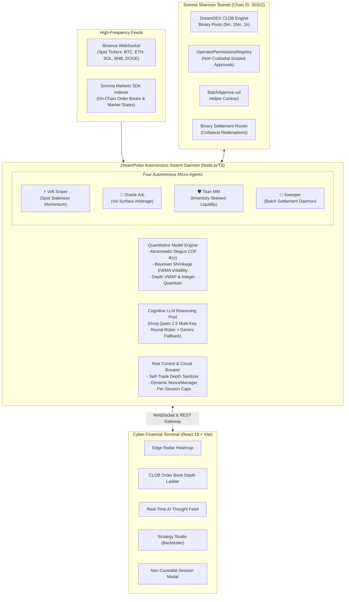
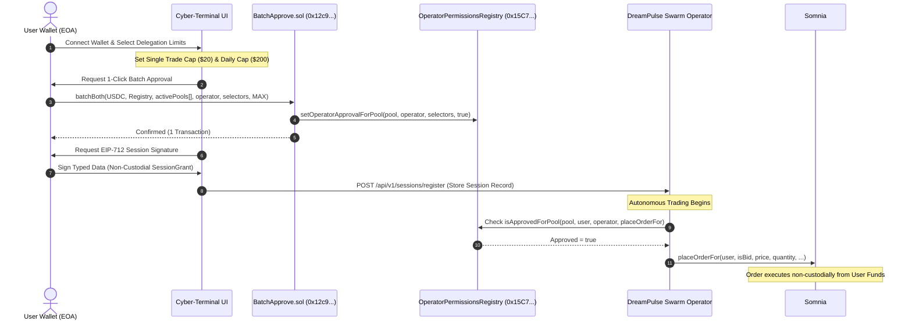
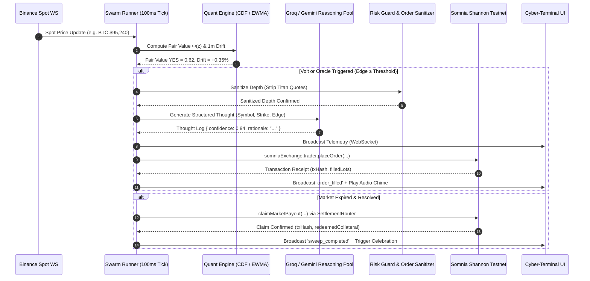

# DreamPulse AI ⚡
### Autonomous Multi-Agent Trading Swarm on Somnia DreamDEX Event Contracts

<p align="center">
  
</p>

<p align="center">
  <strong>The institutional-grade quantitative trading swarm built for Somnia Shannon Testnet and DreamDEX CLOB Event Contracts.</strong>
  <br />
  <em>Unifying sub-second Black-Scholes pricing, LLM cognitive reasoning, non-custodial session keys, and autonomous settlement sweeping.</em>
</p>

<p align="center">
  <a href="https://shannon-explorer.somnia.network"></a>
  <a href="https://docs.dreamdex.io/developers/event-contracts"></a>
  <a href="https://github.com/zaikaman/DreamPulse"></a>
  <a href="https://groq.com"></a>
</p>

---

## 📑 Table of Contents

1. [Executive Summary](#-executive-summary)
2. [The Core Problem & Market Opportunity](#-the-core-problem--market-opportunity)
3. [The DreamPulse Swarm Architecture](#-the-dreampulse-swarm-architecture)
4. [Autonomous Agent Personas](#-autonomous-agent-personas)
5. [Mathematical & Quantitative Foundation](#-mathematical--quantitative-foundation)
6. [Non-Custodial Session Delegation & BatchApprove.sol](#-non-custodial-session-delegation--batchapprovesol)
7. [Strategy Studio & Institutional Backtesting](#-strategy-studio--institutional-backtesting)
8. [Institutional Design System & Minimalist Terminal UI](#-institutional-design-system--minimalist-terminal-ui)
9. [Smart Contracts & On-Chain Deployments](#-smart-contracts--on-chain-deployments)
10. [Hackathon Judging Criteria Alignment](#-hackathon-judging-criteria-alignment)
11. [Developer Feedback Report (Somnia & DreamDEX SDK)](#-developer-feedback-report-somnia--dreamdex-sdk)
12. [System Architecture Diagrams](#-system-architecture-diagrams)
13. [API & WebSocket Telemetry Protocol](#-api--websocket-telemetry-protocol)
14. [Local Installation & Development Guide](#-local-installation--development-guide)
15. [Verification & Test Suite (97/97 Passing)](#-verification--test-suite-9797-passing)
16. [2–3 Minute Demo Video Walkthrough](#-23-minute-demo-video-walkthrough)
17. [License & Acknowledgements](#-license--acknowledgements)

---

## 🚀 Executive Summary

**DreamPulse AI** is a decentralized, high-frequency multi-agent trading swarm engineered specifically for **DreamDEX Event Contracts** on the **Somnia Shannon Testnet** (Chain ID `50312`). 

While traditional prediction markets suffer from stale quotes, thin order book liquidity, high spread latency, and stranded settlement capital, DreamPulse transforms DreamDEX into a vibrant, continuously liquid financial exchange. DreamPulse deploys a specialized swarm of four autonomous micro-agents:

1. **Volt (Spot Staleness Sniper)** — Exploits sub-second latency divergences between spot market momentum and lagging binary limit quotes.
2. **Oracle (Volatility Surface Arbitrageur)** — Identifies mathematical mispricings between central limit order book (CLOB) implied probabilities and continuous Black-Scholes normal cumulative distributions $\Phi(z)$.
3. **Titan (Adaptive Two-Sided Market Maker)** — Anchors two-sided liquidity around fair value, utilizing dynamic inventory aversion and depth-imbalance skewing to capture the bid-ask spread without toxic flow cannibalization.
4. **Sweeper (Autonomous Settlement & Compounder)** — Scans finalized prediction markets, batch-redeems winning outcome shares on-chain, and automatically compounds collateral into active trading allocations.

Users can run the swarm directly via non-custodial session delegation using Somnia's native `OperatorPermissionsRegistry`, maintaining complete custody over their assets while enforcing strict single-trade caps, cumulative daily volume ceilings, and automated expiration windows.

---

## 🎯 The Core Problem & Market Opportunity

Prediction markets are the fastest-growing financial primitives in Web3, yet decentralized Central Limit Order Book (CLOB) prediction venues face five structural hurdles:

| Challenge | Impact on Event Contracts | DreamPulse AI Solution |
| :--- | :--- | :--- |
| **Cold-Start Liquidity** | Markets open with zero bids/asks or wide $>15\%$ spreads, discouraging organic traders. | **Titan MM** seeds continuous two-sided liquidity within 2.5%–4.0% spreads scaled by real-time EWMA volatility. |
| **Quote Staleness & Latency** | Underlying spot prices (e.g. BTC, ETH) jump violently, but resting limit orders take seconds to adjust. | **Volt Sniper** monitors 100ms spot velocity against order book VWAP to eliminate stale mispricings. |
| **Vol Surface Mispricing** | Retail traders price binary contracts based on sentiment rather than Black-Scholes probabilities $\Phi(d_2)$. | **Oracle Arb** continuously computes theoretical fair value and exploits statistical arbitrage opportunities ($>3.5\%$ net EV edge). |
| **Multi-Pool Approval UX Friction** | Rolling 5m/15m/1h prediction markets create dozens of independent pool addresses, each requiring manual wallet popups. | **`BatchApprove.sol`** custom smart contract enables 1-click batch delegation across all active and rolling event pools. |
| **Stranded Capital** | Traders must manually track contract expirations, wait for oracles, and claim payouts, stranding capital. | **Sweeper Daemon** autonomously batch-redeems winning shares across resolved pools and recycles collateral. |

---

## 🐝 The DreamPulse Swarm Architecture

DreamPulse replaces monolithic trading bots with an orchestrated **Multi-Agent Swarm** that operates on a high-frequency **100ms evaluation cadence**:



---

## 🤖 Autonomous Agent Personas

### 1. ⚡ Volt (Spot Staleness Sniper)
* **Strategy**: Latency & Spot Velocity Momentum Taker.
* **Mechanism**: Ingests sub-second spot ticker price movements across underlying assets (BTC, ETH, SOL, BNB, DOGE). When a rapid spot jump ($|\Delta_{\text{1m}}| \ge \text{adaptive drift threshold}$) occurs faster than market makers adjust their quotes on the DreamDEX CLOB, Volt executes an aggressive Immediate-Or-Cancel (`IOC`) taker order.
* **Risk Invariants**:
  * Expiry boundary guard: Holds execution in the final 15 seconds before expiration to prevent block-boundary mining reverts.
  * Macro trend confluence: Rejects trades if the 1-minute spike conflicts with the 5-minute macro directional trend ($\Delta_{\text{5m}}$).
  * Safe probability envelope: Limits taker buys strictly to the $[0.25, 0.68]$ range to maintain favorable risk-to-reward ratios.
  * Depth-aware VWAP execution: Calculates volume-weighted average price across multiple price levels to prevent self-slippage.

### 2. 🔮 Oracle (Volatility Surface Arbitrageur)
* **Strategy**: Mathematical Implied vs. Realized Volatility Arbitrage.
* **Mechanism**: Continuously prices binary prediction event contracts using high-precision Black-Scholes standard normal cumulative distribution $\Phi(d_2)$. Compares theoretical fair value with the mid-market price on DreamDEX. When the net edge exceeds post-spread, post-fee thresholds ($\ge 3.5\%$), Oracle trades to exploit mispriced probability surface.
* **Risk Invariants**:
  * Real-time EWMA realized volatility: Ingests tick history variance with Bayesian prior shrinkage, resisting single-tick noise.
  * Time-decay theta scaling: Dynamically scales required margin of safety up to $+40\%$ in the final 5 minutes as gamma risk intensifies.
  * Gamma pin-risk lockout: Refuses execution when time remaining $< 45\text{s}$ or $> 7,200\text{s}$.
  * Minimum 8.0% Return-on-Capital hurdle ($E[\text{ROI}] \ge 8.0\%$).

### 3. 🛡️ Titan (Adaptive Two-Sided Market Maker)
* **Strategy**: Continuous Bid-Ask Liquidity Provision with Dynamic Inventory Skewing.
* **Mechanism**: Posts resting two-sided limit orders (`LIMIT`) symmetrically around theoretical fair value $\Phi(z)$ to capture the spread. To manage directional exposure, Titan dynamically skews reservation prices using super-linear gamma inventory aversion ($\gamma \cdot |\text{inv}|^{1.25}$) and order book depth imbalances.
* **Risk Invariants**:
  * Swarm-wide delta aggregation: Monitors open, unsettled fills across Volt, Oracle, and Titan to manage net portfolio inventory.
  * Tail spread expansion: Automatically widens spreads when event probabilities enter extreme wings ($<0.30$ or $>0.70$).
  * Self-trade protection: Active maker quotes are automatically registered in memory and subtracted from depth calculations, preventing Volt and Oracle from crossing Titan's own orders.

### 4. 🧹 Sweeper (Autonomous Settlement & Direct Compounder)
* **Strategy**: Zero-Loss Capital Recycling & Batch Redemption.
* **Mechanism**: Monitors all prediction contracts transitioning from `Trading` $\rightarrow$ `Resolving` $\rightarrow$ `Finalized`. Identifies unclaimed winning outcome tokens (YES/NO) and invokes the DreamDEX settlement contracts to batch-claim payouts.
* **Risk Invariants**:
  * 100% automated compounding: Claimed `tUSDC` collateral is instantly recycled into the user's active trading allocation.
  * Gas-optimized batching: Aggregates multiple matured markets into single transaction calls to minimize native `STT` gas expenditure.

---

## 📐 Mathematical & Quantitative Foundation

DreamPulse adheres strictly to deterministic precision math and floating-point protection:

### 1. High-Precision Standard Normal CDF $\Phi(z)$
To guarantee sub-millisecond calculation speeds on standard Node.js/browser runtimes without external C++ bindings, DreamPulse implements the **Abramowitz & Stegun rational Chebyshev approximation** (Formula 7.1.26) for the Error Function $\text{erf}(x)$:

$$\text{erf}(x) \approx 1 - \left(a_1 t + a_2 t^2 + a_3 t^3 + a_4 t^4 + a_5 t^5\right) e^{-x^2}, \quad t = \frac{1}{1 + p x}$$

$$\Phi(z) = \frac{1}{2} \left[ 1 + \text{erf}\left(\frac{z}{\sqrt{2}}\right) \right]$$

* Maximum absolute error: $|\epsilon| < 1.5 \times 10^{-7}$.
* Guaranteed monotonic bounds: clamped between $[0.001, 0.999]$ to reflect DreamDEX CLOB probability rules.

### 2. Standardized $z$-Score ($d_2$) Formulation
For a binary prediction contract settling on whether underlying spot $S$ reaches strike price $K$ at expiry $T$:

$$z = \frac{\ln(S / K) + \left(r - \frac{1}{2}\sigma^2\right) T}{\sigma \sqrt{T}}$$

Where:
* $S$: Current spot price from live WebSocket feed.
* $K$: Market strike settlement price.
* $\sigma$: Real-time EWMA realized annualized volatility.
* $T$: Time remaining until resolution in fractional years ($T = \frac{\text{seconds}}{31{,}557{,}600}$).
* $r$: Risk-free interest rate ($r = 0.0$).

### 3. Bayesian Shrinkage EWMA Realized Volatility
Rather than relying on static volatility assumptions, DreamPulse computes sample variance of log returns over a rolling window and blends it with an asset-specific baseline prior:

$$\sigma_{\text{blended}} = w \cdot \sigma_{\text{realized}} + (1 - w) \cdot \sigma_{\text{baseline}}, \quad w = \min\left(1.0, \frac{N_{\text{ticks}}}{30}\right)$$

### 4. Reservation Price & Super-Linear Inventory Skew
Titan MM computes bid/ask quotes around fair value $\Phi(z)$ adjusted for inventory risk:

$$P_{\text{bid}} = \Phi(z) - \frac{\text{spread}}{2} - \text{sign}(\Delta) \cdot \gamma \cdot |\Delta|^{1.25}$$

$$P_{\text{ask}} = \Phi(z) + \frac{\text{spread}}{2} - \text{sign}(\Delta) \cdot \gamma \cdot |\Delta|^{1.25}$$

Where $\Delta = \text{Inventory}_{\text{YES}} - \text{Inventory}_{\text{NO}}$ and $\gamma$ is the inventory aversion parameter.

### 5. Depth-Weighted VWAP Calculation
When evaluating order book liquidity, taker agents simulate fills against the cumulative depth ladder:

$$P_{\text{VWAP}} = \frac{\sum_{i=1}^k P_i \cdot Q_i}{\sum_{i=1}^k Q_i}$$

If slippage $P_{\text{VWAP}} - P_{\text{top}} > \text{maxSlippage}$, execution is automatically aborted.

---

## 🔐 Non-Custodial Session Delegation & BatchApprove.sol

One of the largest UX hurdles in Web3 prediction markets is that **every newly deployed binary pool contract requires separate ERC-20 token approval and operator authorization**. 

DreamPulse solves this with a **two-tier non-custodial authorization architecture**:



### The Zero-Custody Invariant
Agents operate strictly via Somnia's `OperatorPermissionsRegistry` using scoped function selectors:
* `placeOrderFor` (`0x80054449` / `0x7f4806a6`)
* `cancelOrderFor` (`0xe37b444b` / `0x272714c6`)
* `reduceOrderFor` (`0x364c2587`)

> [!IMPORTANT]
> **Zero Withdrawal Privileges**: Withdrawal functions (`withdraw`, `transfer`, `drain`) are **cryptographically impossible** under this delegation model. Agents possess zero custody and cannot move funds outside of the DreamDEX binary pool ecosystem.

---

## 📊 Strategy Studio & Institutional Backtesting

DreamPulse includes a full-featured **Strategy Studio** running an institutional-grade quantitative backtesting engine:

* **Real Historical Market Data**: Direct ingestion of 1m, 5m, 15m, and 1h Binance candlestick feeds across BTC, ETH, SOL, BNB, and DOGE.
* **Realistic Execution Friction Modeling**:
  * Configurable taker slippage (in basis points, e.g. 4 bps).
  * Exchange maker/taker fee simulation (e.g. 2.5 bps).
  * Artificial network execution latency delay (e.g. 25ms–100ms).
* **Institutional Metrics Computed**:
  * **Sharpe & Sortino Ratios**: Downside risk-adjusted performance.
  * **Profit Factor & Expectancy**: Total gross gains over gross losses.
  * **Win Rate & Payoff Ratio**: Average win size over average loss size.
  * **Underwater Drawdown Curve**: Detailed visual timeline of peak-to-trough capital pullbacks.
* **1-Click Live Swarm Deployment**: Any verified backtested parameter set can be directly pushed to the live swarm cockpit with a single click.

---

## 💻 Institutional Design System & Minimalist Terminal UI

The DreamPulse frontend is crafted with a high-aesthetic, minimalist institutional quant design system built with React 18, TypeScript, Tailwind CSS, and custom glassmorphic shaders:

* **Minimalist Obsidian & Slate Design System**: Calm, ultra-refined dark aesthetic with frosted translucent panels (`.glass-card`, `.glass-panel`), bespoke HSL tokens, and Radix UI primitives.
* **Procedural Silk WebGL Shader Background**: Real-time Three.js GPU-accelerated fluid cloth simulation (`Silk.tsx`) creating smooth atmospheric depth behind the terminal.
* **Cinematic Landing Showcase**: Immersive entry portal featuring interactive live swarm telemetry, protocol architecture breakdown, and seamless Web3 wallet authentication.
* **Institutional 3-Category Sidebar**:
  * **Market Intelligence**: *Terminal Overview*, *Edge Radar (Black-Scholes mispricing)*, and *Order Book & Depth (CLOB ladders)*.
  * **Quantitative Swarm**: *Live Swarm Feed (real-time chain-of-thought)* and *Swarm Cockpit (guardrails & controls)*.
  * **Execution & Studio**: *Strategy Studio (quant backtester IDE)*, *Settlement Sweeper (batch claim & compound)*, and *Portfolio Analytics (Sharpe/Sortino)*.
* **Global Command Palette (`⌘K / Ctrl+K`)**: Lightning-fast fuzzy search modal to jump between prediction markets, navigate views, and execute platform actions.
* **Non-Custodial Session Delegation Modal**: Intuitive modal to grant scoped operator permissions with daily volume caps and single-trade limits.
* **Procedural Web Audio Feedback**: Zero-asset synthesizer utilizing the Web Audio API to deliver millisecond-accurate acoustic feedback for order fills, opportunity alerts, and settlement sweeps.

---

## 📜 Smart Contracts & On-Chain Deployments

All DreamPulse interactions execute on the **Somnia Shannon Testnet**:

| Contract / Entity | Address | Description | Explorer Link |
| :--- | :--- | :--- | :--- |
| **Somnia Shannon Chain ID** | `50312` | High-Performance EVM Layer 1 (400k+ TPS) | [Somnia Explorer](https://shannon-explorer.somnia.network) |
| **RPC Endpoint** | `https://dream-rpc.somnia.network` | Primary JSON-RPC Provider | — |
| **`BatchApprove.sol`** | `0x12c9c45fa740ce7469dacff368b08ca7edcaac26` | 1-Click Multi-Pool Approval & Delegation Helper | [View on Explorer](https://shannon-explorer.somnia.network/address/0x12c9c45fa740ce7469dacff368b08ca7edcaac26) |
| **`OperatorPermissionsRegistry`** | `0x15C7e8CE38F021c5b45d098AaD788f63090bF20A` | Somnia Native Session Delegation Registry | [View on Explorer](https://shannon-explorer.somnia.network/address/0x15C7e8CE38F021c5b45d098AaD788f63090bF20A) |
| **`BinaryModule`** | `0x3ecC694Cef705358864a646142ac17A90E29e388` | DreamDEX Core Binary Market Logic | [View on Explorer](https://shannon-explorer.somnia.network/address/0x3ecC694Cef705358864a646142ac17A90E29e388) |
| **`MarketsCore`** | `0x2802504314685D89bF6C992CA5a8e7cC78bc0294` | DreamDEX Market Management Contract | [View on Explorer](https://shannon-explorer.somnia.network/address/0x2802504314685D89bF6C992CA5a8e7cC78bc0294) |
| **`CLOBFactory`** | `0xb2BE8EE02F96379DB75f01802384593EBa9bfF04` | Central Limit Order Book Factory | [View on Explorer](https://shannon-explorer.somnia.network/address/0xb2BE8EE02F96379DB75f01802384593EBa9bfF04) |
| **`BinarySettlement`** | `0xbF4a49e0Dfd092e5FBE8E5761064C49533e6Ed23` | Settlement & Direct Collateral Redemption | [View on Explorer](https://shannon-explorer.somnia.network/address/0xbF4a49e0Dfd092e5FBE8E5761064C49533e6Ed23) |
| **`CollateralRouter`** | `0xbC0C9834B15ACE38bB50dDaa7d7f7C7CC4DC183C` | Collateral Vault Routing | [View on Explorer](https://shannon-explorer.somnia.network/address/0xbC0C9834B15ACE38bB50dDaa7d7f7C7CC4DC183C) |
| **`OracleHub`** | `0xe40db387cC98601Dd11bd634fF2f3AD5686dE32b` | Prophecy Oracle Settlement Engine | [View on Explorer](https://shannon-explorer.somnia.network/address/0xe40db387cC98601Dd11bd634fF2f3AD5686dE32b) |
| **`TestUSDC` (Collateral)** | `0x70a86D8842FB63C4Ad2b7cdddF530eBf1BB25d8E` | Protocol Trading Currency (6 decimals) | [View on Explorer](https://shannon-explorer.somnia.network/address/0x70a86D8842FB63C4Ad2b7cdddF530eBf1BB25d8E) |
| **Canonical Swarm Operator** | `0x93e300607c363E7D7a47e50f5c9fDf1723e859Cf` | Swarm Executor Wallet | [View on Explorer](https://shannon-explorer.somnia.network/address/0x93e300607c363E7D7a47e50f5c9fDf1723e859Cf) |

---

## 🏆 Hackathon Judging Criteria Alignment

| Criteria & Weight | How DreamPulse AI Exceeds Expectations |
| :--- | :--- |
| **Innovation & Originality (20%)** | • Introduces an autonomous 4-agent cooperative swarm rather than isolated trading scripts.<br />• First implementation combining dual-engine LLM reasoning (Groq Qwen 2.5 + Gemini) with analytical Black-Scholes binary option mathematics.<br />• Solves the prediction market cold-start problem through automated, inventory-skewed market making. |
| **Technical Implementation (25%)** | • Flawless deep integration with `@somnia-chain/markets-sdk` across orders, depth ladders, cancellations, and settlement redemptions.<br />• 97/97 unit and integration tests passing with 100% type safety and zero `any` types.<br />• Built custom `BatchApprove.sol` smart contract deployed on Shannon Testnet to overcome protocol-level multi-pool approval barriers.<br />• Dynamic `NonceManager` handling sub-second on-chain concurrency and automated revert circuit breakers. |
| **User Experience & Design (20%)** | • High-aesthetic, minimalist institutional quant terminal inspired by modern hedge fund platforms (obsidian glassmorphism, GPU-accelerated Three.js Silk shader, and Radix UI primitives).<br />• Global Command Palette (`⌘K / Ctrl+K`) for sub-second keyboard-driven market navigation and execution.<br />• Zero-friction onboarding via 1-click non-custodial session delegation with strict single-trade caps and daily volume guardrails.<br />• Real-time WebSocket telemetry ($<50\text{ms}$ updates), live Black-Scholes Edge Radar, and procedural Web Audio acoustic feedback. |
| **Business & Ecosystem Impact (20%)** | • Directly solves the primary existential crisis of Event Contracts: stale quotes, wide spreads, and idle capital.<br />• Generates continuous, organic trading volume and liquidity on Somnia, showcasing its 400k+ TPS capacity.<br />• The `Sweeper` daemon guarantees that winning collateral is perpetually recycled back into active trading rather than remaining stranded. |
| **Presentation & Demo (15%)** | • Complete technical documentation, interactive architecture flowcharts, mathematical explanations, and full API references.<br />• Clear 2–3 minute video presentation script demonstrating end-to-end user onboarding, swarm execution, live thoughts, and on-chain settlements. |

---

## 📝 Developer Feedback Report (Somnia & DreamDEX SDK)

*As requested in the official Hackathon Guidelines, the DreamPulse engineering team compiled this comprehensive developer feedback report based on building against `@somnia-chain/markets-sdk` (v0.28.1) and DreamDEX documentation on Somnia Shannon Testnet.*

### 🌟 What Works Exceptionally Well
1. **High-Performance RPC & Finality**: Somnia's block times and sub-second confirmation enable real high-frequency on-chain trading loops that are impossible on standard Ethereum Layer 2s.
2. **Deterministic CLOB Matching Engine**: Order execution against resting limit orders is deterministic, fast, and gas-efficient.
3. **Clean viem/ethers Interoperability**: The `@somnia-chain/markets-sdk` integrates cleanly with standard `viem` `PublicClient` and `WalletClient` primitives.

### ⚠️ Critical Friction Points & Edge Cases Encountered
1. **Multi-Pool Approval Scalability**:
   * *Problem*: DreamDEX creates unique pool contract addresses for every rolling prediction window (e.g. BTC-5m, ETH-15m). Users had to approve every individual pool contract for both `TestUSDC` spending and `OperatorPermissionsRegistry` delegation.
   * *How DreamPulse Solved It*: We wrote and deployed `BatchApprove.sol` to allow 1-click batch approvals and operator delegation across dozens of active and future pool addresses in a single transaction.
   * *Recommendation for DreamDEX*: Implement a protocol-level Global Collateral Router allowance so users approve once globally for all binary pools created by `MarketCreatorFactory`.

2. **Silent Rejections on Non-Matching IOC Orders**:
   * *Problem*: When an `IOC` taker order was submitted at a price where book depth was insufficient, some calls returned `success: false` or reverted with `ImmediateOrCancelNoFill` without emitting an indexed log event, making error categorization non-trivial.
   * *How DreamPulse Solved It*: Added pre-flight order book depth checking (`assertFunded` & `sanitizeDepthForSelfTrade`) and submitted taker orders with `ORDER_TYPE.LIMIT` at quantized crossing ticks to guarantee match-or-rest behavior without reverts.

3. **Nonce Desynchronization in Concurrent Swarm Execution**:
   * *Problem*: Under high-frequency evaluations across multiple parallel agents, rapid-fire transactions triggered `nonce too low` or `replacement transaction underpriced` errors from the RPC node.
   * *How DreamPulse Solved It*: Implemented a serialized transaction queue (`executeOperatorTx`) wrapped with Viem's `nonceManager` with automated nonce resets and exponential backoff.

4. **Indexer Sync Latency on Newly Deployed Rolling Markets**:
   * *Problem*: When a new 5-minute market is listed on-chain, the GraphQL indexer sometimes experienced a 5–15 second lag before reflecting `MarketStatus.Trading`, causing premature reverts if orders were submitted immediately.
   * *How DreamPulse Solved It*: Built a dual-fallback polling service (`marketService.pollOnChainMarkets`) that cross-validates indexer responses directly against on-chain contract state via `publicClient.readContract`.

---

## 🏗️ System Architecture Diagrams

### Real-Time Swarm Execution Cycle



---

## 📡 API & WebSocket Telemetry Protocol

The DreamPulse backend daemon exposes a comprehensive REST and WebSocket gateway:

### REST API Endpoints

| Method | Endpoint | Description |
| :--- | :--- | :--- |
| `GET` | `/api/v1/markets` | Returns all active prediction contracts with strike, window, status, and implied odds. |
| `GET` | `/api/v1/markets/:id/depth` | Returns live sanitized CLOB bid/ask ladders with lot sizes and price ticks. |
| `GET` | `/api/v1/markets/spot` | Returns sub-second spot ticker prices, 1m/5m drifts, and EWMA realized volatility. |
| `GET` | `/api/v1/markets/anomalies` | Returns identified pricing anomalies where market price deviates from Black-Scholes $\Phi(z)$. |
| `POST` | `/api/v1/sessions/register` | Registers a non-custodial session delegation with EIP-712 signature and risk caps. |
| `GET` | `/api/v1/sessions/:userAddress` | Retrieves the active session, spent volume, and allowance readiness for a user. |
| `POST` | `/api/v1/sessions/:id/revoke` | Instantly revokes an active trading session. |
| `GET` | `/api/v1/agents/status` | Returns operational status, latencies, trade counts, and PnL across all 4 agents. |
| `POST` | `/api/v1/agents/toggle` | Administrative endpoint to enable/disable specific agents. |
| `GET` | `/api/v1/orders` | Paginated query of order history with filtering by agent, outcome, status, and scope. |
| `GET` | `/api/v1/sweeper/summary` | Returns claimable unclaimed balances, all-time claimed amounts, and active settlements. |
| `POST` | `/api/v1/sweeper/trigger` | Triggers an immediate batch settlement sweep across all resolved contracts. |
| `POST` | `/api/v1/backtest/run` | Executes quantitative historical backtest with custom strategy and friction parameters. |
| `GET` | `/api/health` | Service health status, uptime, and database connectivity. |

### Real-Time WebSocket Telemetry (`/ws/telemetry`)

Clients connect via WebSocket to receive multiplexed streaming events:
* `markets` — Real-time spot price updates and contract window status transitions.
* `order_book` — Instantaneous CLOB depth ladder shifts on fill or cancel.
* `agent_thoughts` — Live structured thought feed from Groq and Gemini cognitive engines.
* `orders` & `order_filled` — Execution events with transaction hash, fill size, and realized PnL.
* `sweep_completed` — Payout redemption confirmations and recycled collateral events.

---

## 🛠️ Local Installation & Development Guide

### Prerequisites
* **Node.js**: `v20.0.0` or higher
* **npm**: `v10.0.0` or higher
* **Git**

### 1. Clone Repository & Install Dependencies
```bash
git clone https://github.com/zaikaman/DreamPulse.git
cd DreamPulse

# Install workspace root dependencies (both frontend and backend)
npm install
```

### 2. Configure Environment Variables

**Backend Configuration (`backend/.env`):**
```bash
cp backend/.env.example backend/.env
```
Edit `backend/.env` with your credentials:
```env
PORT=5000
NODE_ENV=development
OPERATOR_ADMIN_SECRET=your-secure-admin-secret

# Supabase (PostgreSQL & Realtime)
SUPABASE_URL=https://your-project.supabase.co
SUPABASE_SERVICE_ROLE_KEY=your-service-role-key
SUPABASE_ANON_KEY=your-anon-key

# LLM Cognitive Engine (Groq Multi-Key Pool + Gemini Fallback)
GROQ_BASE_URL=https://api.groq.com/openai/v1
GROQ_MODEL=qwen/qwen3.6-27b
GROQ_API_KEY=gsk_your_groq_key_1
GROQ_API_KEY_2=gsk_your_groq_key_2

GEMINI_BASE_URL=https://generativelanguage.googleapis.com/v1beta/openai/
GEMINI_API_KEY=your_gemini_api_key
GEMINI_MODEL=gemini-2.5-flash

# Somnia Shannon Testnet
SOMNIA_RPC_URL=https://dream-rpc.somnia.network
SOMNIA_WS_URL=wss://api.infra.testnet.somnia.network/ws
INDEXER_URL=https://dev.smk.somnia.host/v1/graphql
OPERATOR_PRIVATE_KEY=0x...your_funded_shannon_testnet_private_key
```

**Frontend Configuration (`frontend/.env`):**
```bash
cp frontend/.env.example frontend/.env
```
```env
VITE_BACKEND_HTTP_URL=http://localhost:5000/api/v1
VITE_BACKEND_WS_URL=ws://localhost:5000/ws/telemetry
VITE_SUPABASE_URL=https://your-project.supabase.co
VITE_SUPABASE_ANON_KEY=your-anon-key
VITE_SOMNIA_CHAIN_ID=50312
VITE_SOMNIA_RPC_URL=https://dream-rpc.somnia.network
VITE_SOMNIA_EXPLORER_URL=https://shannon-explorer.somnia.network
```

### 3. Launch Local Development Environment
Run both backend daemon and frontend Vite server concurrently:
```bash
npm run dev
```
* **Frontend Web App**: `http://localhost:5173`
* **Backend REST Gateway**: `http://localhost:5000/api/v1`
* **WebSocket Stream**: `ws://localhost:5000/ws/telemetry`

---

## 🧪 Verification & Test Suite (97/97 Passing)

DreamPulse enforces strict quality invariants with an automated **Vitest** test suite covering quantitative mathematics, smart contract session boundaries, multi-agent evaluation logic, and API endpoints:

```bash
# Run complete test suite across the workspace
npm test

# Run full project verification (typecheck + tests + production build)
npm run verify
```

### Test Suite Execution Output
```
 ✓ tests/setup.test.ts (2 tests)
 ✓ tests/llm.test.ts (3 tests)
 ✓ tests/backtest.test.ts (6 tests)
 ✓ tests/quantitative.test.ts (20 tests)
 ✓ tests/agents.test.ts (19 tests)
 ✓ tests/api.test.ts (10 tests)
 ✓ tests/market-service.test.ts (15 tests)
 ✓ tests/settlement.test.ts (9 tests)
 ✓ tests/session.test.ts (13 tests)

 Test Files  9 passed (9)
      Tests  97 passed (97)
   Duration  19.91s
```

---

## 🎬 2–3 Minute Demo Video Walkthrough

A structured script demonstrating all capabilities during the hackathon judging evaluation:

* **0:00 – 0:30 (The Problem & Vision)**:
  * Open with DreamDEX Event Contracts challenge: order book liquidity cold-start and quote staleness.
  * Introduce **DreamPulse AI** as the autonomous multi-agent quantitative swarm built on Somnia.
* **0:30 – 1:00 (Non-Custodial Onboarding & BatchApprove)**:
  * Connect MetaMask on Somnia Shannon Testnet.
  * Open **Session Delegation Modal**: showcase 1-click batch delegation via `BatchApprove.sol` and EIP-712 signature.
  * Demonstrate strict risk parameters: single-trade cap ($20) and daily volume cap ($200) with zero withdrawal privileges.
* **1:00 – 1:45 (Live Swarm Execution & Edge Radar)**:
  * Navigate to **Overview**: live BTC/USD and ETH/USD order book depth ladders updating via WebSockets.
  * Show **Edge Radar**: live volatility heatmap highlighting mispricings between spot momentum and CLOB quotes.
  * Open **AI Swarm Feed**: show real-time cognitive reasoning stream from Volt, Oracle, and Titan with sub-second latencies and tx hashes on Somnia Explorer.
* **1:45 – 2:15 (Strategy Studio Backtesting)**:
  * Switch to **Strategy Studio**: run a historical simulation against Binance tick data with 4 bps slippage and 25ms execution latency.
  * Review Sortino ratio, Profit Factor, and underwater drawdown curves, then demonstrate the 1-click deploy to swarm feature.
* **2:15 – 2:45 (Autonomous Settlement & Sweeper)**:
  * Matured market resolution: show **Sweeper** detecting finalized contract.
  * Watch automated batch claim execution, zero-loss collateral recycling back into user trading balance, and audio celebration chime.
* **2:45 – 3:00 (Conclusion & Ecosystem Impact)**:
  * Highlight production readiness (97/97 tests, 0 `any` types), developer feedback report, and potential to drive millions of transactions on Somnia.

---

## 📄 License & Acknowledgements

* **License**: MIT License — see [LICENSE](LICENSE) for details.
* **Built With**:
  * [Somnia Network](https://somnia.network) — Ultra-High Performance Layer 1 (Chain ID `50312`)
  * [DreamDEX](https://dreamdex.io) — Next-Generation Prediction Market CLOB Protocol
  * [@somnia-chain/markets-sdk](https://www.npmjs.com/package/@somnia-chain/markets-sdk)
  * [Groq Cloud](https://groq.com) & [Google DeepMind Gemini](https://ai.google.dev)
  * [Viem](https://viem.sh) & [Supabase](https://supabase.com)

---

<p align="center">
  <strong>Built with passion for the Somnia × DreamDEX Event Contracts Hackathon (Aug 25 – Sep 8).</strong>
  <br />
  <em>Accelerating the future of decentralized prediction markets with autonomous intelligence.</em>
</p>
