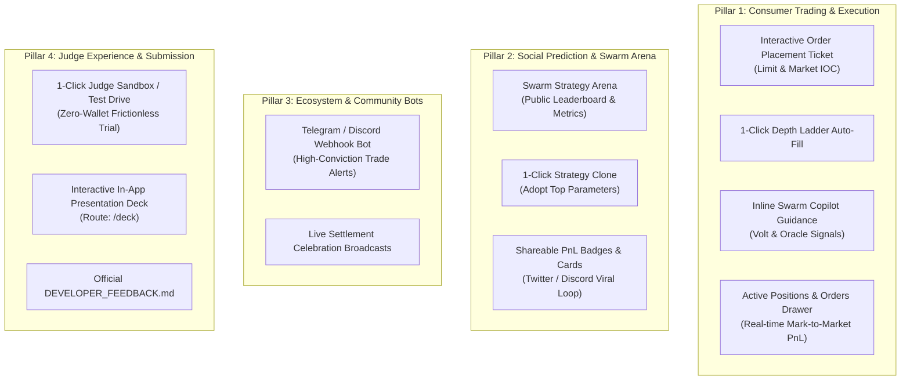

# DreamPulse AI — Strategic Roadmap & Hackathon Enhancement Proposals
**Date:** August 27, 2026  
**Target:** Somnia × DreamDEX Event Contracts Hackathon (Aug 25 – Sep 8, 2026)  
**Remaining Runway:** ~12–13 Days  
**Prize Pool:** $5,000 USDso + Somnia Discord Showcase + Social Media Spotlight  

---

## 1. Executive Summary & Context

DreamPulse AI has already established a high-frequency, mathematically grounded multi-agent trading swarm on **Somnia Shannon Testnet** (Chain ID `50312`) and **DreamDEX CLOB Event Contracts**. With sub-second Black-Scholes pricing $\Phi(z)$, Bayesian EWMA realized volatility, non-custodial session delegation via Somnia's native `OperatorPermissionsRegistry` and custom `BatchApprove.sol`, and a 97/97 passing test suite, the technical core is institutional-grade.

However, based on the official [hackathon brief](file:///d:/DreamPulse/hackathon.md), hackathons are not judged purely on technical algorithms alone. They evaluate:
1. **Innovation & Originality (20%)**
2. **Technical Implementation (25%)**
3. **User Experience & Design (20%)**
4. **Business & Ecosystem Impact (20%)**
5. **Presentation & Demo (15%)**

The brief explicitly invites developers to build:
* **Consumer-facing trading applications**
* **AI-powered trading agents**
* **Analytics tools**
* **Social prediction products**
* **Entirely new experiences**

This document outlines **critical gaps identified in the current build**, **recommended high-impact features**, and an **actionable 13-day roadmap** to ensure DreamPulse captures 1st place.

---

## 2. Competitive Audit Against Judging Criteria

| Judging Criteria (Weight) | Current Status in DreamPulse | Gap / Opportunity |
| :--- | :--- | :--- |
| **Innovation & Originality (20%)** | 4-agent cooperative swarm (Volt, Oracle, Titan, Sweeper) + continuous Black-Scholes $\Phi(z)$ pricing + dual LLM reasoning (Groq/Gemini). | Connect LLM reasoning to real-world market catalysts (news/macro sentiment) rather than purely post-drift ticker movements. |
| **Technical Implementation (25%)** | Custom `BatchApprove.sol`, `OperatorPermissionsRegistry` integration, deep `@somnia-chain/markets-sdk` usage, 97/97 passing tests. | Add interactive manual order placement on the CLOB and real-time open positions management. |
| **User Experience & Design (20%)** | Obsidian glassmorphic terminal, WebGL Silk shader, `⌘K` command palette, procedural audio. | Provide a 1-click **Judge Sandbox Demo** mode so judges without testnet tokens can test drive the app immediately without friction. |
| **Business & Ecosystem Impact (20%)** | Titan seeds liquidity, Volt eliminates staleness, Sweeper compounds winning collateral. | Add **Social Swarm Arena** (Leaderboard, 1-Click Strategy Cloning) and automated **Discord/Telegram Swarm Webhooks**. |
| **Presentation & Demo (15%)** | Video script in README, built-in documentation. | Create a dedicated standalone `DEVELOPER_FEEDBACK.md` and an interactive in-app **Presentation Deck (`/deck`)**. |

---

## 3. The 5 Strategic Blind Spots

1. **Read-Only Order Book (Missing Consumer Trading Experience)**:
   * When users click "Trade" in [OverviewView.tsx](file:///d:/DreamPulse/frontend/src/components/dashboard/OverviewView.tsx#L367) or navigate to [MarketsDepthView.tsx](file:///d:/DreamPulse/frontend/src/components/dashboard/MarketsDepthView.tsx), the [OrderBookDepth](file:///d:/DreamPulse/frontend/src/components/OrderBookDepth.tsx) component is read-only. Traders cannot place manual Limit or Market orders directly on the CLOB.
2. **Missing "Social Prediction" Track**:
   * While `COPY` vs `PERSONAL` swarms exist, personal swarms are isolated. There is no social discovery, public leaderboard, or ability to clone winning community agent strategies.
3. **The "Judge Token Friction" Barrier**:
   * Judges evaluating dozens of submissions might not have Shannon Testnet STT or TestUSDC immediately. Without a 1-click sandbox/demo mode, they encounter disabled buttons and can only browse static views.
4. **Reactive Rather than Predictive AI Reasoning**:
   * Volt triggers on price momentum after spot has already moved on Binance. Adding an autonomous News / Catalyst Sentinel gives judges a visual demonstration of LLM intelligence understanding *why* markets are moving.
5. **Submission Formalities**:
   * The hackathon requires:
     * A formal **SDK & Documentation Feedback Report** (best submitted as a standalone, pristine markdown document).
     * A **Presentation Deck** (which can be rendered directly inside the web app for a jaw-dropping presentation).

---

## 4. Proposed High-Impact Features & Architectural Specs



### Feature 1: Interactive CLOB Order Placement Ticket ("Trader Cockpit") [COMPLETED]
* **Motivation**: Fulfills the hackathon's explicit *"consumer-facing trading application"* requirement.
* **Status**: **Fully Implemented** in [TraderCockpitTicket.tsx](file:///d:/DreamPulse/frontend/src/components/dashboard/TraderCockpitTicket.tsx), [OrderBookDepth.tsx](file:///d:/DreamPulse/frontend/src/components/OrderBookDepth.tsx), and [MarketsDepthView.tsx](file:///d:/DreamPulse/frontend/src/components/dashboard/MarketsDepthView.tsx).
* **Key Specifications**:
  * **1-Click Ladder Interaction**: Clicking any Ask row automatically pre-fills a BUY YES order ticket at that exact price and size; clicking any Bid row pre-fills BUY NO.
  * **Order Types**: Toggle between `LIMIT` (rests on the Somnia CLOB) and `MARKET (IOC)` (immediate cross-fill).
  * **Collateral Slider & Presets**: Quick-select `$5`, `$10`, `$25`, `$50`, `MAX`, showing calculated share payout ($1.00/lot upon winning).
  * **Swarm Copilot Live Signal**: Inline badge directly in the order ticket:
    * *Volt*: "Momentum favors YES (+0.32% 1m spot drift)".
    * *Oracle*: "Overpriced by 4.2% $\Phi(z)$, favorable risk-reward on NO".
  * **Zero-Gas / Session Execution**: Uses the user's active session key via `placeOrderFor` for instant sub-second execution, or falls back to MetaMask wallet signing.

### Feature 2: Active Positions & Open Orders Drawer
* **Motivation**: Allows traders to monitor their open inventory across rolling prediction windows.
* **Key Specifications**:
  * Persistent dock or collapsible drawer at the bottom of the Terminal.
  * **Tabs**:
    * *Open Positions*: Shows active contract symbol, outcome held (YES/NO), entry price, current mid-market price, unrealized PnL ($ and %), and countdown to contract expiration.
    * *Resting Limit Orders*: Displays active maker orders posted by Titan or manual limits with 1-click `Cancel Order` via `cancelOrderFor`.
    * *Settled / Pending Sweep*: Shows matured contracts ready for automated redemption.

### Feature 3: Swarm Arena & Strategy Leaderboard (Social Prediction)
* **Motivation**: Fulfills the hackathon's *"social prediction products"* and *"ecosystem adoption"* requirements.
* **Component Location**: New tab in navigation: `Swarm Arena` (`#arena`).
* **Key Specifications**:
  * **Leaderboard Table**: Ranks anonymous wallet strategies or curated archetypes (e.g. *Conservative Market Maker*, *Aggressive Vol Sniper*, *Tail-Risk Arbitrageur*) by:
    * 24h & 7d PnL (USDC and %)
    * Win Rate (%) & Total Fills
    * Sharpe & Sortino Ratios
    * Strategy Parameters (Volt drift threshold, Oracle minEdge, Titan spread & inventory aversion).
  * **1-Click Strategy Clone**: Clicking "Clone Strategy" imports that configuration directly into the user's `PersonalSwarmCockpit` and prompts to activate.
  * **Viral PnL Card Generator**: "Share My Swarm" generates a styled obsidian graphic or tweetable preview with the user's stats and Somnia Explorer verification.

### Feature 4: 1-Click "Demo Sandbox / Test Drive" Mode for Judges
* **Motivation**: Eliminates evaluation friction for hackathon judges who lack testnet tokens or network setup.
* **Component Location**: Banner button on Landing Hero and console header: `"Launch Sandbox Test Drive"`.
* **Key Specifications**:
  * Injects a client-side simulated wallet session pre-loaded with `1,000 tUSDC` virtual balance.
  * Connects to live WebSocket feeds so live prices and order books remain real, but orders are filled against simulated book state.
  * Allows judges to toggle agents, adjust sliders, trigger manual trades, and run backtests instantly.
  * Displays a discrete badge: `"SANDBOX TEST DRIVE — Switch to Live Testnet anytime"`.

### Feature 5: Automated Discord & Telegram Webhook Bot
* **Motivation**: Somnia and DreamDEX organizers actively monitor community channels; an automated bot makes the project impossible to overlook.
* **Backend Location**: [`backend/src/services/webhook-service.ts`](file:///d:/DreamPulse/backend/src/services).
* **Key Specifications**:
  * Configurable Discord / Telegram webhook URLs in `backend/.env`.
  * Automatically dispatches rich embed notifications when:
    * Volt executes a high-conviction snipe ($>0.3\%$ drift).
    * Oracle detects an extreme mispricing ($>5.0\%$ edge).
    * Sweeper successfully executes a batch redemption and compounds profits.
  * Embeds direct links to Somnia Shannon Explorer transactions and DreamDEX contracts.

### Feature 6: Autonomous Catalyst & Sentiment Sentinel ("Sentry" Agent)
* **Motivation**: Elevates the "Innovation & Originality" score by moving beyond numeric price feeds into qualitative AI reasoning.
* **Key Specifications**:
  * Ingests real-time crypto headline feeds (CoinGecko/Binance News or RSS).
  * Uses the existing Groq/Gemini cognitive engine to output a structured sentiment score:
    * `asset`: BTC / ETH
    * `sentiment`: Bullish / Bearish / Neutral (-1.0 to +1.0)
    * `catalystScore`: High / Medium / Low
    * `summary`: 1-sentence breakdown of the news event
  * Streams into the `AgentThoughtFeed` under a new agent badge: **`SENTRY (Catalyst)`**.
  * Adjusts Titan's spread (e.g. widening quotes when breaking high-volatility news is detected).

### Feature 7: Official Hackathon Submission Deliverables Package
* **In-App Presentation Deck (`/deck`)**:
  * An interactive, keyboard-navigable slide deck built directly into the React app.
  * **Slide 1**: The Problem (Stale quotes, cold-start liquidity, multi-pool approval friction).
  * **Slide 2**: The DreamPulse Solution (4-Agent autonomous swarm).
  * **Slide 3**: Mathematical Rigor (Abramowitz-Stegun CDF, Bayesian EWMA, Inventory Skew).
  * **Slide 4**: Zero-Custody Architecture (BatchApprove.sol & OperatorPermissionsRegistry).
  * **Slide 5**: Live Metrics & Test Verification (97/97 tests, 100% type safety).
  * **Slide 6**: Somnia & DreamDEX Ecosystem Impact & Roadmap.
* **Dedicated `DEVELOPER_FEEDBACK.md`**:
  * Standalone markdown report documenting:
    1. What works exceptionally well with `@somnia-chain/markets-sdk`.
    2. Multi-pool approval friction and how `BatchApprove.sol` solved it.
    3. Silent reverts on IOC non-matching orders.
    4. Nonce concurrency management under multi-agent load.
    5. Proposed SDK extensions for the DreamDEX developer team.

---

## 5. Prioritized 13-Day Action Plan (Timeline: Aug 28 – Sep 8)

```
┌─────────────────────────────────────────────────────────────────────────────┐
│                       13-DAY IMPLEMENTATION SPRINT                          │
├──────────────┬─────────────────────────────┬────────────────────────────────┤
│ Days 1–3     │ Trading & Execution         │ • Interactive CLOB Order Ticket│
│ (Aug 28–30)  │ (Consumer App Track)        │ • 1-Click Depth Ladder Fills   │
│              │                             │ • Active Positions Drawer      │
├──────────────┼─────────────────────────────┼────────────────────────────────┤
│ Days 4–6     │ Social & Community          │ • Swarm Arena & Leaderboard    │
│ (Aug 31–Sep 2│ (Social Prediction Track)   │ • 1-Click Strategy Cloning     │
│              │                             │ • Shareable PnL Badges         │
├──────────────┼─────────────────────────────┼────────────────────────────────┤
│ Days 7–9     │ Bots & Judge Experience     │ • 1-Click Judge Sandbox Mode   │
│ (Sep 3–5)    │ (Ecosystem & Usability)     │ • Discord/Telegram Webhook Bot │
│              │                             │ • Sentry Catalyst Feed (LLM)   │
├──────────────┼─────────────────────────────┼────────────────────────────────┤
│ Days 10–13   │ Submission Perfection       │ • Interactive In-App Deck      │
│ (Sep 6–8)    │ (Presentation & Demo Track) │ • Standalone DEVELOPER_FEEDBACK│
│              │                             │ • 2–3 Min Video Recording      │
│              │                             │ • Full Verification & Freeze   │
└──────────────┴─────────────────────────────┴────────────────────────────────┘
```

### Detailed Phase Breakdown

#### Phase 1: Consumer Trading & Execution (Days 1–3 | Aug 28–30)
1. **Build `OrderEntryTicket.tsx`**:
   * Add buy/sell forms for YES and NO outcomes.
   * Add inputs for shares/collateral with quick preset chips (`$5`, `$10`, `$25`, `MAX`).
   * Support both `LIMIT` and `MARKET (IOC)` order types.
2. **Hook Order Book Click-to-Fill**:
   * Wire `OrderBookDepth.tsx` row clicks to pre-fill the order ticket.
3. **Build `PositionsDrawer.tsx`**:
   * Display active open inventory and resting orders.
   * Add 1-click cancel for open maker limit orders.
4. **Run `npm run verify`**:
   * Ensure tests and builds pass with zero type errors.

#### Phase 2: Social Swarm Arena (Days 4–6 | Aug 31–Sep 2)
1. **Build `SwarmArenaView.tsx`**:
   * Render public leaderboard of top-performing agent configurations.
   * Display 24h PnL, Win Rate, and Sortino ratios.
2. **Implement 1-Click Strategy Clone**:
   * Allow users to inspect any configuration and clone it directly to their personal swarm settings.
3. **Add Shareable PnL Cards**:
   * Render visually striking shareable summary cards with verified Somnia badges.

#### Phase 3: Judge Sandbox & Community Bots (Days 7–9 | Sep 3–5)
1. **Implement "Judge Sandbox / Test Drive" Mode**:
   * Add a top-level toggle enabling instant evaluation without wallet connection.
   * Simulate order placement, fills, and sweeper compounding with virtual balance.
2. **Build Webhook Service**:
   * Implement Discord/Telegram webhook triggers in `backend/src/services/webhook-service.ts`.
   * Test notifications on testnet trades and payouts.
3. **Optional Sentry Catalyst Sentinel**:
   * Add news headline ingestion and LLM sentiment scoring in the thought feed.

#### Phase 4: Submission Polish & Video Walkthrough (Days 10–13 | Sep 6–8)
1. **Build In-App Presentation Deck (`/deck`)**:
   * Create 6 clean, animated slides showcasing architecture, quantitative formulas, and traction.
2. **Create Standalone `DEVELOPER_FEEDBACK.md`**:
   * Format the SDK feedback report as an official submission document.
3. **Record 2–3 Minute Demo Video**:
   * Follow the structured script in [README.md](file:///d:/DreamPulse/README.md#23-minute-demo-video-walkthrough).
   * Record high-resolution screen capture with smooth narration.
4. **Final Repository Freeze**:
   * Execute full verification: `npm run verify`.
   * Tag release on GitHub.

---

## 6. Conclusion & Next Step

DreamPulse already possesses the most sophisticated mathematical and multi-agent foundation in the hackathon. Implementing **Phase 1 (Interactive Consumer Trading Ticket)** and **Phase 2 (Swarm Arena & Leaderboard)** will bridge the gap between autonomous backend algorithms and a consumer-facing product, ensuring maximum scoring across all 5 judging criteria.
