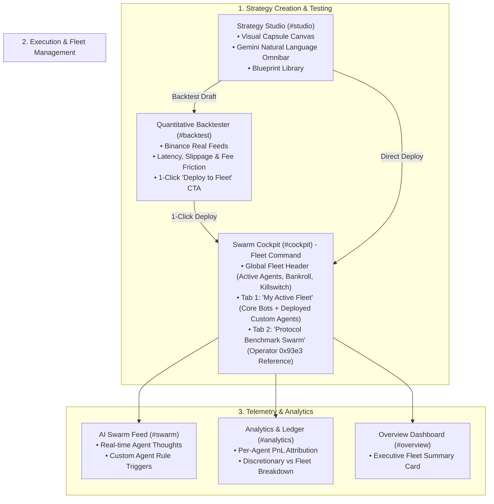
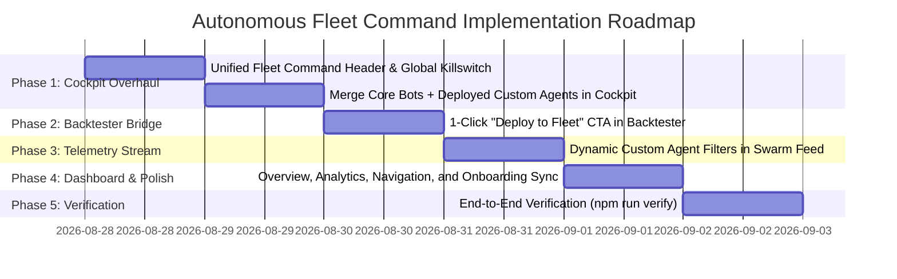

# Autonomous Fleet Command Architecture & UI/UX Unification Plan

**Document ID**: `docs/fleet_command_architecture_plan.md`  
**Status**: Ready for Implementation  
**Target Platform**: DreamPulse (Somnia Shannon Testnet & Binance Feeds)  

---

## 1. Executive Summary & Vision

### 1.1 The Problem
Previously, DreamPulse was architected around **3 fixed canonical agents** (*Volt Sniper*, *Oracle Vol Arb*, *Titan MM*). With the introduction of **Strategy Studio**, users can now create, backtest, and deploy an **unlimited number of custom trading agents** with dedicated tUSDC bankroll allowances. 

However, the user experience currently suffers from fragmentation:
1. **Disconnected Active Roster**: The *Swarm Cockpit* only displays the 3 hardcoded bots. If a user deploys custom agents in the *Strategy Studio*, those agents are invisible in the cockpit.
2. **Missing Direct Workflow Bridge**: When a user achieves a profitable backtest in the *Backtester*, there is no direct CTA to deploy that tested strategy into their active fleet with a chosen allowance.
3. **Siloed Telemetry**: The *AI Swarm Feed* only filters for the 3 core bots, omitting live rule triggers and evaluations from custom deployed agents.
4. **Scattered Portfolio Context**: *Overview* and *Analytics* pages do not yet attribute performance across the user's expanded multi-agent fleet.

### 1.2 The Solution: "Autonomous Fleet Command"
We will unify the entire platform under the **Fleet Command** paradigm:
* **The Strategy Studio (`#studio`)** is the *Workshop & Blueprint Library* (invent, prompt, visual-code, store).
* **The Backtester (`#backtest`)** is the *Simulation Lab* (replay against real historical Binance/Somnia candles with friction modeling).
* **The Swarm Cockpit (`#cockpit`)** becomes the *Active Fleet Command* (one unified dashboard displaying all running agents—both Core and Custom—with live bankroll meters, killswitches, and parameter controls).
* **The AI Swarm Feed (`#swarm`)** streams *Live Cognitive Telemetry* for all running fleet agents.



---

## 2. Comprehensive UI/UX Redesign by Page

---

### Page 1: Swarm Cockpit (`#cockpit`) — *Unified Fleet Command*

#### Current Limitations
* Two stacked blocks: fixed `AgentSwarmCockpit` and hardcoded 3-card `PersonalSwarmCockpit`.
* Deployed custom agents are absent.

#### Redesign Specifications
1. **Global Fleet Telemetry Banner & Emergency Killswitch**:
   * **Fleet Status Metric Cards**:
     * `Active Running Fleet`: Total count of active bots (e.g., `2 Core + 3 Custom Active`).
     * `Total Capital Allocated`: Sum of all bankroll allowances (e.g., `$650.00 tUSDC`).
     * `Fleet Realized PnL (24h)`: Cumulative realized profit/loss across all fleet executions.
     * `Execution Mode`: Badge showing `PERSONAL ISOLATED` or `COPY PROTOCOL` or `PAUSED (COPILOT ONLY)`.
   * **Global Action Controls**:
     * `[ Pause All Fleet ]` / `[ Resume All Fleet ]` master emergency switch.
     * `[ + Deploy New Agent ]` shortcut opening Strategy Studio.

2. **Dual-Tab Architecture**:
   * **Tab A: `My Active Fleet` (Default)**:
     * Card Grid displaying all running and paused agents for the connected wallet:
       * **Core Protocol Agents**: *Volt Sniper*, *Oracle Arb*, *Titan MM* (with individual parameter tuning sliders and toggles).
       * **Custom Strategy Agents**: Every custom agent deployed from Strategy Studio.
     * **Card Anatomy for Every Agent**:
       * Agent Name, Custom Color Accent, Strategy Type badge (`MOMENTUM`, `MEAN_REVERSION`, `CUSTOM`).
       * Target Asset & Timeframe (`BTC/USD · 1m`).
       * **Dedicated tUSDC Bankroll Allowance Progress Meter**:
         * Shows `Allocated: $X.00`, `Spent: $Y.00`, `Remaining: $Z.00`.
         * Visual progress bar (Green $\rightarrow$ Yellow $\rightarrow$ Red).
       * Inline `[ Adjust Allowance ]` quick editor.
       * 1-Click `[ Deploy / Pause ]` toggle.
       * `[ Backtest ]` and `[ Edit Logic ]` actions.
     * If no custom agents are deployed yet, an empty state card with a prominent `[ + Create Custom Agent ]` CTA.
   * **Tab B: `Protocol Benchmark Swarm`**:
     * Transparent, read-only view of the Operator’s canonical swarm (`0x93e3...59Cf`).
     * Displays reference signal latency, implied probability skew, and quoting metrics so traders can benchmark their custom fleet against the protocol default.

---

### Page 2: Strategy Studio (`#studio`) — *Workshop & Blueprint Library*

#### Current State
* Contains Visual Capsule Canvas (`BUILDER`) and Custom Strategy Library (`LIBRARY`).

#### Redesign Specifications
* **Section 5 (Bankroll Allowance & Leash)**:
  * Retain preset buttons (`$25`, `$50`, `$100`, `$250`, `$500`) and custom numerical input.
  * Dual Action buttons: `[ Save Draft ]` and `[ Save & Deploy to Fleet ($X tUSDC) ]`.
* **Strategy Library Cards**:
  * Display clear status pill:
    * `● DEPLOYED IN FLEET` (Emerald badge linking directly to `#cockpit`).
    * `○ DRAFT BLUEPRINT` (Secondary badge).
  * 1-Click `[ Deploy to Fleet ]` / `[ Pause ]` button.
  * `[ Backtest Replay ]` button opening the Backtester with this exact strategy configuration pre-loaded.

---

### Page 3: Quantitative Backtester (`#backtest`) — *Simulation Lab with Direct Deploy*

#### Current State
* Replays historical Binance/Somnia candles for Canonical bots and custom strategy ASTs.

#### Redesign Specifications
1. **Performance HUD Bridge**:
   * Right beneath the Key Performance Metrics (Win Rate, Profit Factor, Max Drawdown, Net PnL), add a high-impact **Fleet Deployment Action Card**:
     * *"Satisfied with this strategy's historical metrics?"*
     * Preset allowance selector (`$50`, `$100`, `$250`, Custom).
     * Primary CTA: **`[ Deploy Strategy to Active Fleet ($100 tUSDC) ]`**.
     * Secondary CTA: **`[ Edit in Strategy Studio ]`**.
   * Clicking `Deploy` immediately persists the strategy with `isDeployed: true`, assigns the chosen bankroll allowance, and navigates the user to `#cockpit` with a confirmation notification.

---

### Page 4: AI Swarm Feed (`#swarm`) — *Full Fleet Telemetry Stream*

#### Current Limitations
* Filter bar is hardcoded to `ALL`, `Volt`, `Oracle`, `Titan`, `Sweeper`.

#### Redesign Specifications
1. **Dynamic Fleet Filter Bar**:
   * Filter chips dynamically populated from all active Core bots + deployed Custom Agents:
     * `[ All Activity ]`
     * `[ Volt ]`, `[ Oracle ]`, `[ Titan ]`, `[ Sweeper ]`
     * `[ Custom: RSI Dip Sniper ]`, `[ Custom: Alpha Rider ]`, etc.
2. **Custom Agent Thought Cards**:
   * Thoughts generated by custom agents display their unique color tag and rule trigger details (e.g., *"RSI (14) = 24.5 < 28 & Bollinger Lower Touched $\rightarrow$ Triggering $10 CALL on BTC/USD"*).

---

### Page 5: Overview Dashboard (`#overview`) — *Executive Mission Control*

#### Redesign Specifications
* **Swarm Status Card in Stat Grid**:
  * Update headline to **`Active Fleet`**.
  * Shows count: `X Agents Running` (e.g., `4 Active Bots`).
  * Subtext: `$Y.00 tUSDC Total Bankroll Allocated · 24h PnL +$Z.00`.
  * Clicking card opens `Swarm Cockpit (#cockpit)`.

---

### Page 6: Trade Terminal (`#trade`) — *Discretionary Terminal with Fleet Awareness*

#### Redesign Specifications
* Keep the primary focus on fast manual execution and AI Copilot suggestions.
* Add a subtle status pill in the market header bar:
  * *"⚡ 2 Fleet Agents monitoring this asset (Volt + RSI Sniper)"*.
  * Provides seamless awareness between manual trading and autonomous fleet activity.

---

### Page 7: Portfolio Analytics (`#analytics`) — *Fleet-Aware Attribution*

#### Redesign Specifications
* In the **Agent Breakdown** widget (when filtering by `SWARM` source or `ALL`):
  * List custom deployed agents alongside canonical bots with individual Win Rate, Trade Count, Volume, and Net PnL.

---

### Page 8: Navigation & Sidebar (`Sidebar.tsx` / `AppSidebar.tsx` / `CommandDialog.tsx`)

#### Redesign Specifications
* Re-organize menu items into 3 intuitive logical clusters:
  1. **TRADING & MARKETS**:
     * `Overview` (`#overview`)
     * `Edge Radar` (`#radar`)
     * `Markets & Depth` (`#markets`)
     * `Trade Terminal` (`#trade`)
  2. **AUTONOMOUS AGENTS & AI**:
     * `Fleet Cockpit` (`#cockpit`) — *Manage all active Core & Custom agents*
     * `Strategy Studio` (`#studio`) — *Visual No-Code Builder & Library*
     * `Backtester` (`#backtest`) — *Quantitative Simulation Lab*
     * `AI Swarm Feed` (`#swarm`) — *Live Cognitive Stream*
  3. **PORTFOLIO & SETTLEMENT**:
     * `Analytics` (`#analytics`)
     * `Settlement Sweeper` (`#settlement`)

---

### Page 9: Onboarding Tour (`OnboardingWizardModal.tsx`)

#### Redesign Specifications
* Step 4: Introduce **Strategy Studio & Fleet Command** (Visual builder $\rightarrow$ Backtester $\rightarrow$ Dedicated Bankroll Allowance Deployment).
* Step 5: Choose your starting journey:
  1. **Discretionary Trader** (Trade Terminal with AI Copilot).
  2. **Swarm Follower** (1-click copy-trade Core Protocol bots).
  3. **Swarm Architect** (Build & deploy your own custom multi-agent fleet).

---

## 3. Backend & Data Architecture

### 3.1 Database Schema (`custom_agents` table in Supabase)
```sql
-- custom_agents table definition (already verified with valid UUIDs)
CREATE TABLE IF NOT EXISTS public.custom_agents (
    id UUID PRIMARY KEY DEFAULT gen_random_uuid(),
    user_address VARCHAR(42) NOT NULL,
    name VARCHAR(64) NOT NULL,
    description TEXT,
    symbol VARCHAR(32) NOT NULL DEFAULT 'BTC/USD',
    timeframe VARCHAR(8) NOT NULL DEFAULT '5m',
    strategy_type VARCHAR(32) NOT NULL DEFAULT 'MOMENTUM',
    rules JSONB NOT NULL DEFAULT '{}'::jsonb,
    color VARCHAR(16) NOT NULL DEFAULT '#2dd4bf',
    icon VARCHAR(32) NOT NULL DEFAULT 'BoltIcon',
    is_active BOOLEAN NOT NULL DEFAULT TRUE,
    is_deployed BOOLEAN NOT NULL DEFAULT FALSE,
    allocated_allowance NUMERIC(12, 2) NOT NULL DEFAULT 100.00,
    spent_allowance NUMERIC(12, 2) NOT NULL DEFAULT 0.00,
    created_at TIMESTAMPTZ NOT NULL DEFAULT NOW(),
    updated_at TIMESTAMPTZ NOT NULL DEFAULT NOW(),
    CONSTRAINT valid_custom_agent_address CHECK (user_address ~ '^0x[a-fA-F0-9]{40}$')
);
```

### 3.2 REST API Endpoints
| Method | Path | Description |
| :--- | :--- | :--- |
| `GET` | `/api/v1/agents/custom` | Retrieves starter templates + user custom agents. |
| `POST` | `/api/v1/agents/custom` | Creates a new custom agent with rules and initial allowance. |
| `PUT` | `/api/v1/agents/custom/:id` | Updates an existing agent definition. |
| `DELETE` | `/api/v1/agents/custom/:id` | Deletes a custom agent. |
| `POST` | `/api/v1/agents/custom/:id/deploy` | Deploys agent for execution with optional bankroll allowance. |
| `POST` | `/api/v1/agents/custom/:id/pause` | Halts autonomous execution for an agent. |
| `POST` | `/api/v1/agents/custom/:id/allowance` | Updates allocated tUSDC bankroll allowance. |
| `POST` | `/api/v1/agents/generate` | Synthesizes JSON rules from natural language prompt via dedicated Gemini API. |

---

## 4. Phased Implementation Roadmap



### Phase 1: Swarm Cockpit Overhaul (`PersonalSwarmCockpit.tsx` & `SwarmCockpitView.tsx`)
* [ ] Integrate `useCustomAgents` hook into `PersonalSwarmCockpit.tsx`.
* [ ] Add Global Fleet Metrics Banner (Total active agents, Total allocated bankroll, Global killswitch).
* [ ] Render Tab 1 (`My Active Fleet`) with unified card grid:
  * Core bots (Volt, Oracle, Titan) with parameter sliders.
  * Custom deployed agents with live bankroll allowance meters, spent progress bar, pause toggle, and allowance editor.
  * Persistent `[ + Build New Strategy ]` shortcut card.
* [ ] Render Tab 2 (`Protocol Benchmark Swarm`) for transparent operator benchmark monitoring.

### Phase 2: Backtester $\rightarrow$ Fleet Bridge (`StrategyStudio.tsx`)
* [ ] Add high-impact "Deploy to Active Fleet with Allowance" card directly inside the Backtester simulation results HUD.
* [ ] Handle 1-click deployment: persist with `isDeployed: true`, assign allowance, and redirect to `#cockpit`.

### Phase 3: AI Swarm Feed Dynamic Telemetry (`SwarmFeedView.tsx` & `AgentThoughtFeed.tsx`)
* [ ] Dynamically include deployed Custom Agents in the thought filter bar.
* [ ] Display rule evaluation and trigger rationale badges for custom agents.

### Phase 4: Dashboard, Analytics, Navigation, and Onboarding Sync
* [ ] Update `OverviewView.tsx` stat card to reflect Fleet count and allocated capital.
* [ ] Update `Sidebar.tsx`, `AppSidebar.tsx`, and `CommandDialog.tsx` with clean navigation labels and 3-cluster categorization.
* [ ] Update `OnboardingWizardModal.tsx` steps 4 & 5 to present the 3 user paths.

### Phase 5: Verification & Quality Invariants
* [ ] Run `npm run verify` to guarantee zero TypeScript errors, 100% test pass rate (103+ tests), and clean production builds.
* [ ] Verify that all components strictly adhere to the **No Emojis Rule** (Heroicons only).
* [ ] Play PowerShell completion chime.

---

## 5. Quality Invariants & Constraints

1. **Strict No Emojis Rule**: All UI iconography must use `@heroicons/react/24/outline` exclusively. No raw emojis in any component or markdown strings.
2. **Main Branch Development**: All commits and development must occur directly on `main` (no feature branches).
3. **Zero Mock Code**: All allowances, deployment statuses, and rule evaluations must bind to live API endpoints and PostgreSQL Supabase storage.
4. **Mandatory Verification**: Every implementation milestone must conclude with `npm run verify` passing cleanly with 0 errors.
