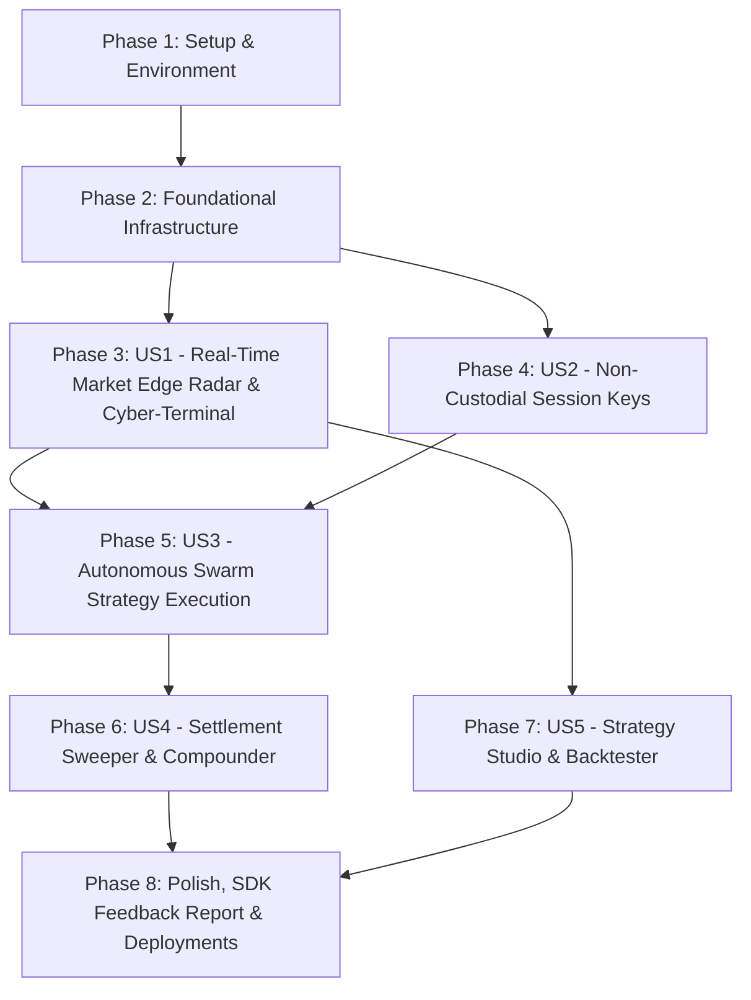

# Tasks: DreamPulse AI

**Input**: Design documents from `/specs/001-dreampulse-ai/`  
**Prerequisites**: [plan.md](file:///d:/DreamPulse/specs/001-dreampulse-ai/plan.md), [spec.md](file:///d:/DreamPulse/specs/001-dreampulse-ai/spec.md), [data-model.md](file:///d:/DreamPulse/specs/001-dreampulse-ai/data-model.md), [research.md](file:///d:/DreamPulse/specs/001-dreampulse-ai/research.md), [contracts/](file:///d:/DreamPulse/specs/001-dreampulse-ai/contracts/)  

---

## Phase 1: Setup (Shared Infrastructure & Environment)

**Purpose**: Project initialization, directory structure, dependencies, and build harnesses for frontend and backend.

- [ ] T001 Initialize root workspace configuration and `.gitignore` covering `node_modules`, `.env`, and build artifacts in `.gitignore`
- [ ] T002 [P] Initialize `backend/` directory with `package.json`, Node 20+ engine configuration, and dependencies (`express`, `ws`, `@supabase/supabase-js`, `viem`, `openai`, `dotenv`, `cors`, `zod`, `tsx`, `vitest`) in `backend/package.json`
- [ ] T003 [P] Configure TypeScript compilation settings for backend in `backend/tsconfig.json`
- [ ] T004 [P] Initialize `frontend/` directory with Vite + React 18+ + TypeScript template in `frontend/package.json`
- [ ] T005 [P] Configure Vite build, proxy, and alias options in `frontend/vite.config.ts` and `frontend/tsconfig.json`
- [ ] T006 [P] Create environment variable template for backend in `backend/.env.example`
- [ ] T007 [P] Create environment variable template for frontend in `frontend/.env.example`
- [ ] T008 [P] Setup Vitest test runner configuration for backend quantitative and unit tests in `backend/vitest.config.ts`

---

## Phase 2: Foundational (Blocking Prerequisites)

**Purpose**: Core infrastructure, database schemas, quantitative math library, blockchain connectors, and base agent architecture that MUST be complete before user stories can execute.

- [ ] T009 Create Supabase SQL migration script defining tables (`markets`, `sessions`, `agent_strategies`, `orders`, `sweeps`, `agent_logs`, `backtests`), indices, and Row Level Security (RLS) policies in `backend/src/config/schema.sql`
- [ ] T010 [P] Implement Supabase client singleton with service-role and anon authentication wrappers in `backend/src/config/supabase.ts`
- [ ] T011 [P] Implement Somnia Shannon Testnet RPC client, chain definition (Chain ID 50312), and contract address mappings in `backend/src/config/somnia.ts`
- [ ] T012 [P] Implement high-precision normal Cumulative Distribution Function $\Phi(z)$ and Black-Scholes probability calculator in `backend/src/quantitative/cdf.ts`
- [ ] T013 [P] Implement quantitative event contract fair-value pricing and spot-drift calculation engine in `backend/src/quantitative/pricing.ts`
- [ ] T014 [P] Implement tick-size and lot-step snapping quantizer adhering to DreamDEX protocol increments in `backend/src/quantitative/quantizer.ts`
- [ ] T015 [P] Implement comprehensive unit tests for $\Phi(z)$ CDF, pricing formulas, and quantizers in `backend/tests/quantitative.test.ts`
- [ ] T016 [P] Implement OpenAI-compatible Gemini LLM client supporting structured JSON reasoning in `backend/src/llm/client.ts`
- [ ] T017 [P] Implement LLM Prompt templates and real-time reasoning generator in `backend/src/llm/reasoning-service.ts`
- [ ] T018 Implement abstract base agent class `BaseAgent` with lifecycle hooks, risk guards, and event emitters in `backend/src/agents/base-agent.ts`
- [ ] T019 Implement WebSocket broadcasting gateway and connection registry in `backend/src/websocket/server.ts`
- [ ] T020 Implement Express API application entrypoint, CORS, request logging, and error middleware in `backend/src/index.ts`
- [ ] T021 [P] Implement Cyber-Terminal CSS design system tokens, high-contrast themes, and monospace typography in `frontend/src/styles/terminal.css`
- [ ] T022 [P] Implement frontend shared TypeScript types matching backend schemas in `frontend/src/types/index.ts`
- [ ] T023 [P] Implement Supabase browser client and Realtime subscription manager in `frontend/src/services/supabase.ts`
- [ ] T024 [P] Implement REST API client adapter for backend communication in `frontend/src/services/api.ts`

**Checkpoint**: Foundational infrastructure ready. All quantitative math verified with unit tests. User story development can now proceed.

---

## Phase 3: User Story 1 - Real-Time Market Edge Radar & Live Cyber-Terminal (Priority: P1) 🎯 MVP

**Goal**: Traders and liquidity providers can monitor all active 5m/15m/1h BTC/ETH event contracts, view real-time implied probability vs fair value $\Phi(z)$ discrepancies, inspect animated depth charts, and view live AI thought streams.

**Independent Test**: Load terminal UI at `http://localhost:5173`, observe live updating Market Matrix across BTC/ETH expiries, observe calculated edge percentages and anomaly highlights in the Discrepancy Heatmap, and verify that the AI Thought Stream displays timestamped reasoning logs.

### Implementation for User Story 1

- [ ] T025 [P] [US1] Implement DreamDEX Event Contracts polling and spot price aggregator service in `backend/src/services/market-service.ts`
- [ ] T026 [P] [US1] Implement Edge Radar anomaly detector identifying pricing discrepancies where $|\text{Mid} - \Phi(z)| > \text{threshold}$ in `backend/src/services/anomaly-service.ts`
- [ ] T027 [US1] Implement REST endpoints `GET /api/v1/markets` and `GET /api/v1/markets/:id/depth` in `backend/src/api/routes.ts`
- [ ] T028 [US1] Implement periodic 100ms WebSocket broadcaster emitting `market_tick` and `depth_update` events in `backend/src/websocket/market-emitter.ts`
- [ ] T029 [P] [US1] Implement React hook `useMarkets` for querying market states and subscribing to Supabase Realtime in `frontend/src/hooks/useMarkets.ts`
- [ ] T030 [P] [US1] Implement React hook `useTelemetry` for handling streaming WebSocket market ticks in `frontend/src/hooks/useTelemetry.ts`
- [ ] T031 [P] [US1] Implement `MarketMatrix` component displaying active 5m, 15m, 1h contracts with countdown timers, implied probabilities, and edge gauges in `frontend/src/components/MarketMatrix.tsx`
- [ ] T032 [P] [US1] Implement `EdgeRadarHeatmap` component visualizing real-time market mispricings across all expiries in `frontend/src/components/EdgeRadarHeatmap.tsx`
- [ ] T033 [P] [US1] Implement `OrderBookDepth` component rendering visual bid/ask ladders and depth visualizer in `frontend/src/components/OrderBookDepth.tsx`
- [ ] T034 [P] [US1] Implement `AgentThoughtFeed` component rendering streaming AI reasoning logs with confidence badges in `frontend/src/components/AgentThoughtFeed.tsx`
- [ ] T035 [US1] Integrate `MarketMatrix`, `EdgeRadarHeatmap`, `OrderBookDepth`, and `AgentThoughtFeed` into main application dashboard in `frontend/src/App.tsx`
- [ ] T036 [US1] Add unit and integration tests for Market Service and Anomaly Detector in `backend/tests/market-service.test.ts`

**Checkpoint**: User Story 1 complete. Terminal provides live market telemetry, depth ladders, discrepancy heatmaps, and AI thought logs without wallet connection.

---

## Phase 4: User Story 2 - Non-Custodial Session-Key Delegation & Safety Guardrails (Priority: P1)

**Goal**: Users can authorize automated AI agents to execute trades on their behalf via Somnia's `OperatorPermissionsRegistry` with strict zero-withdrawal guarantees and user-configured risk ceilings.

**Independent Test**: Connect a Web3 wallet on Somnia Shannon Testnet, sign a scoped session grant with risk limits (e.g., max 10 STT per trade, max 50 STT daily cap), verify the grant is persisted with `is_active = true`, test that withdrawal transactions are strictly rejected, and verify that clicking "Revoke" instantly halts session authorization.

### Implementation for User Story 2

- [ ] T037 [P] [US2] Implement Somnia `OperatorPermissionsRegistry` ABI bindings and EIP-712 typed data signing helpers in `backend/src/config/permissions-abi.ts`
- [ ] T038 [P] [US2] Implement Session Management service verifying non-custodial signatures, enforcing risk caps, and tracking daily spend in `backend/src/services/session-service.ts`
- [ ] T039 [US2] Implement REST endpoints `POST /api/v1/sessions/register`, `GET /api/v1/sessions/:userAddress`, and `POST /api/v1/sessions/:id/revoke` in `backend/src/api/routes.ts`
- [ ] T040 [P] [US2] Implement unit tests for session risk validation, daily volume caps, and expiration checks in `backend/tests/session.test.ts`
- [ ] T041 [P] [US2] Implement Web3 wallet connection provider and Somnia Shannon Testnet auto-switch adapter in `frontend/src/services/web3.ts`
- [ ] T042 [P] [US2] Implement React hook `useSessionKey` for handling session creation, signing, and revocation in `frontend/src/hooks/useSessionKey.ts`
- [ ] T043 [P] [US2] Implement `SessionDelegationModal` component with risk parameter sliders (trade size cap, daily cap, expiration), 1-click EIP-712 signing, and active status indicator in `frontend/src/components/SessionDelegationModal.tsx`
- [ ] T044 [P] [US2] Implement `SessionStatusBar` component displaying active operator address, daily volume remaining, and 1-click Revoke button in `frontend/src/components/SessionStatusBar.tsx`
- [ ] T045 [US2] Integrate session delegation controls and status bar into main header in `frontend/src/App.tsx`

**Checkpoint**: User Stories 1 and 2 functional. Users can securely delegate non-custodial session permissions to the trading engine with mathematical and contract-level safety.

---

## Phase 5: User Story 3 - Autonomous Multi-Agent Swarm Strategy Execution (Priority: P2)

**Goal**: Autonomous agents (`Volt` sniper, `Oracle` volatility surface arb, and `Titan` market maker) continuously evaluate live market data, generate structured LLM reasoning, and execute on-chain orders via session keys within risk guardrails.

**Independent Test**: Enable `Volt` Sniper agent, simulate a spot price jump, and verify that `Volt` executes an immediate IOC taker order against a lagging resting quote, broadcasting an `order_filled` WebSocket event and logging the fill in the user's order history.

### Implementation for User Story 3

- [ ] T046 [P] [US3] Implement `Volt` Spot Staleness Sniper agent evaluating spot drift vs order book lag in `backend/src/agents/volt-sniper.ts`
- [ ] T047 [P] [US3] Implement `Oracle` Volatility Surface Arbitrage agent evaluating cumulative distribution probability $\Phi(z)$ in `backend/src/agents/oracle-arb.ts`
- [ ] T048 [P] [US3] Implement `Titan` Adaptive Market Maker agent quoting two-sided orders with inventory-aware skewing in `backend/src/agents/titan-mm.ts`
- [ ] T049 [US3] Implement Order Execution service interacting with DreamDEX Event Contracts CLOB via Somnia `OperatorPermissionsRegistry.placeOrderFor` in `backend/src/services/order-service.ts`
- [ ] T050 [US3] Implement multi-agent swarm runner loop executing parallel evaluations every 100ms with circuit-breaker protection in `backend/src/agents/swarm-runner.ts`
- [ ] T051 [US3] Implement REST endpoints `GET /api/v1/agents/status`, `POST /api/v1/agents/toggle`, and `GET /api/v1/orders` in `backend/src/api/routes.ts`
- [ ] T052 [P] [US3] Implement React hook `useAgentSwarm` managing agent configurations, toggle states, and live performance metrics in `frontend/src/hooks/useAgentSwarm.ts`
- [ ] T053 [P] [US3] Implement `AgentSwarmCockpit` component with individual agent toggle switches, strategy parameter sliders, real-time PnL badges, and target market pickers in `frontend/src/components/AgentSwarmCockpit.tsx`
- [ ] T054 [P] [US3] Implement `OrderHistoryTable` component displaying executed trades, outcome tokens, lot sizes, fill prices, and Somnia transaction explorer links in `frontend/src/components/OrderHistoryTable.tsx`
- [ ] T055 [US3] Integrate `AgentSwarmCockpit` and `OrderHistoryTable` into dashboard in `frontend/src/App.tsx`
- [ ] T056 [US3] Add unit and execution simulation tests for Volt, Oracle, and Titan agents in `backend/tests/agents.test.ts`

**Checkpoint**: User Stories 1, 2, and 3 complete. Autonomous multi-agent swarm trades 24/7 on Somnia testnet under non-custodial session authorization.

---

## Phase 6: User Story 4 - Autonomous Settlement Sweeper & Collateral Compounder (Priority: P2)

**Goal**: Background sweeper automatically discovers finalized prediction markets with winning positions, executes batch payout claims on-chain, and optionally auto-compounds collateral back into the user's trading balance.

**Independent Test**: Simulate or create a finalized winning position, trigger or wait for the Sweeper cycle, verify on-chain batch claim execution, confirm that user collateral balance updates automatically, and observe the `sweep_completed` notification.

### Implementation for User Story 4

- [ ] T057 [P] [US4] Implement `Sweeper` agent scanning `listBinaryMarkets({ status: "Finalized" })` and detecting unclaimed payouts in `backend/src/agents/sweeper.ts`
- [ ] T058 [US4] Implement Batch Settlement Claim service executing `batchClaimPayouts` on Somnia Event Contracts in `backend/src/services/settlement-service.ts`
- [ ] T059 [US4] Implement Auto-Compounder logic allocating claimed proceeds back into active user trading allocations in `backend/src/services/compounder-service.ts`
- [ ] T060 [US4] Implement REST endpoint `POST /api/v1/sweeper/trigger` and `GET /api/v1/sweeper/history` in `backend/src/api/routes.ts`
- [ ] T061 [P] [US4] Implement `SweeperControls` component with auto-sweep toggle, unclaimed balance indicator, manual "Sweep Now" button, and redemption history in `frontend/src/components/SweeperControls.tsx`
- [ ] T062 [P] [US4] Implement celebratory claim visual animations (confetti burst and win notification) in `frontend/src/components/ClaimCelebration.tsx`
- [ ] T063 [US4] Integrate `SweeperControls` and `ClaimCelebration` into terminal UI in `frontend/src/App.tsx`
- [ ] T064 [US4] Add unit and integration tests for Sweeper and Settlement Claim service in `backend/tests/settlement.test.ts`

**Checkpoint**: User Stories 1 through 4 operational. Winnings are automatically claimed and compounded without capital stagnation.

---

## Phase 7: User Story 5 - Strategy Studio & Historical Backtesting Simulator (Priority: P3)

**Goal**: Quantitative traders can backtest custom rule sets and risk parameters against historical prediction contract streams using `@dreamdex-bot-kit/backtest`, viewing PnL curves, Sharpe ratios, and max drawdowns with 1-click deployment to live swarm.

**Independent Test**: Open Strategy Studio tab, select 5m BTC contracts, set drift threshold to 0.25%, click "Run Backtest", verify simulated PnL curve and metrics are rendered within 3 seconds, and click "Deploy Strategy" to load parameters into live agent cockpit.

### Implementation for User Story 5

- [ ] T065 [P] [US5] Implement historical contract data replay engine and backtest executor using `@dreamdex-bot-kit/backtest` in `backend/src/services/backtest-service.ts`
- [ ] T066 [US5] Implement REST endpoints `POST /api/v1/backtest/run` and `GET /api/v1/backtest/history` in `backend/src/api/routes.ts`
- [ ] T067 [P] [US5] Implement React hook `useBacktest` managing simulation requests, execution status, and results caching in `frontend/src/hooks/useBacktest.ts`
- [ ] T068 [P] [US5] Implement `StrategyStudio` component with strategy configuration forms, historical date range pickers, PnL performance charts, and win rate gauges in `frontend/src/components/StrategyStudio.tsx`
- [ ] T069 [US5] Implement "Deploy Strategy to Swarm" button syncing optimized backtest parameters directly into live agent configuration in `frontend/src/components/StrategyStudio.tsx`
- [ ] T070 [US5] Integrate `StrategyStudio` tab and navigation into main terminal in `frontend/src/App.tsx`
- [ ] T071 [US5] Add unit tests for Backtest Service verifying Sharpe ratio, win rate, and drawdown formulas in `backend/tests/backtest.test.ts`

**Checkpoint**: All 5 User Stories fully implemented, independently testable, and integrated.

---

## Phase 8: Polish, Hackathon Feedback Deliverable & Deployment Hardening

**Purpose**: Hackathon documentation deliverables, production deployment configuration for Heroku and Vercel, audio/visual micro-interactions, and end-to-end verification.

- [ ] T072 [P] Author official DreamDEX SDK Developer Feedback Report detailing developer ergonomics, type safety, event lifecycle observations, and improvement recommendations in `docs/SDK_FEEDBACK_REPORT.md`
- [ ] T073 [P] Configure Heroku `Procfile` with web dyno (`node dist/index.js`) and background agent worker dyno (`node dist/agents/swarm-runner.js`) in `backend/Procfile`
- [ ] T074 [P] Configure Vercel edge deployment configuration with SPA routing rewrites and security headers in `frontend/vercel.json`
- [ ] T075 [P] Implement health check and telemetry status endpoint `GET /api/health` in `backend/src/api/routes.ts`
- [ ] T076 [P] Add audio feedback sound effects (synthesizer hum, trade fill click, win chime) with user mute toggle in `frontend/src/services/audio.ts`
- [ ] T077 [P] Add keyboard shortcut handlers (e.g. `Space` to pause swarm, `S` to trigger sweep, `1-4` to toggle views) in `frontend/src/hooks/useKeyboardShortcuts.ts`
- [ ] T078 Create comprehensive README documentation with architecture diagrams, demo video link, and local setup instructions in `README.md`
- [ ] T079 Execute end-to-end integration test suite validating full user flow (market discovery -> session delegation -> agent execution -> sweep claim) in `backend/tests/e2e.test.ts`
- [ ] T080 Verify production build commands (`npm run build` in both `frontend` and `backend`) pass with zero TypeScript errors and zero lint warnings

---

## Dependencies & Execution Order



### User Story Dependencies
- **US1 (Real-Time Edge Radar)**: Depends only on Foundational (Phase 2). Can be delivered as standalone MVP.
- **US2 (Session Keys)**: Depends on Foundational (Phase 2). Enables non-custodial execution authorization.
- **US3 (Autonomous Swarm)**: Depends on US1 (Market feeds) and US2 (Session authorization).
- **US4 (Settlement Sweeper)**: Depends on US3 (Position tracking) and US2 (Execution authorization).
- **US5 (Strategy Backtester)**: Depends on Foundational math (Phase 2) and US1 (Market contracts model).
- **Phase 8 (Polish & Deploy)**: Depends on all user stories being functional.

---

## Parallel Opportunities

```bash
# Phase 1 Parallel Tasks:
T002 (backend package.json), T003 (backend tsconfig), T004 (frontend package.json), T005 (frontend vite config), T006 (backend .env), T007 (frontend .env), T008 (backend vitest config)

# Phase 2 Parallel Tasks:
T010 (supabase config), T011 (somnia config), T012 (cdf math), T013 (pricing engine), T014 (quantizer), T015 (math tests), T016 (gemini client), T017 (reasoning service), T021 (terminal css), T022 (frontend types), T023 (frontend supabase), T024 (frontend api client)

# Phase 3 (US1) Parallel Tasks:
T025 (market service), T026 (anomaly service), T029 (useMarkets hook), T030 (useTelemetry hook), T031 (MarketMatrix), T032 (EdgeRadarHeatmap), T033 (OrderBookDepth), T034 (AgentThoughtFeed)
```

---

## Implementation Strategy

### Incremental Delivery Milestones
1. **Milestone 1 (Foundation + US1)**: Live Cyber-Terminal visualising all Somnia 5m/15m/1h prediction markets, depth ladders, $\Phi(z)$ discrepancy heatmaps, and streaming AI reasoning (Standalone analytical value).
2. **Milestone 2 (US2 + US3)**: 1-Click Non-Custodial Session Key onboarding + Autonomous 24/7 Swarm Trading (`Volt` sniper, `Oracle` volatility arb, `Titan` market maker).
3. **Milestone 3 (US4)**: Automated Sweeper claiming finalized market winnings and auto-compounding collateral.
4. **Milestone 4 (US5 + Polish)**: Strategy Studio backtester + SDK feedback deliverable + Vercel/Heroku production readiness.
